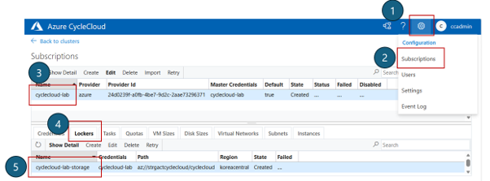

# 2. Cluster-Init 및 커스텀 스크립트

CycleCloud에서 노드 기동 시 스크립트를 실행하는 방법은 **cloud-init** 과 **cluster-init** 두 가지가 있습니다.

cloud-init을 수정하면 전체 클러스터 재기동이 필요(CycleCloud 8.3 기준)하여 운영 중인 클러스터에 영향을 줄 수 있습니다. 따라서 특별한 이유가 없다면 **cluster-init을 사용합니다.**

---

## 2.1 cloud-init vs cluster-init

| 항목 | cloud-init | cluster-init (권장) |
|------|------------|---------------------|
| **제공 주체** | Azure / VMSS | CycleCloud 전용 |
| **실행 시점** | VM 최초 부팅 시 1회 | CycleCloud가 노드를 구성(converge)할 때마다 |
| **설정 방식** | YAML (user-data) | 셸 스크립트 + spec 디렉터리 구조 |
| **재실행** | 불가 | `jetpack converge` 로 재실행 가능 |
| **버전 관리** | 불가 | CycleCloud 프로젝트 단위로 관리·배포 |
| **수정 시 영향** | 전체 클러스터 재기동 필요 | 개별 노드 단위 적용 가능 |

> 🚨 **KT 운영 규칙: cloud-init 수정 금지**
>
> 운영 중인 클러스터에서 노드 구성 스크립트를 작성할 때는 **반드시 cluster-init 프로젝트 방식**을 사용합니다.

### CloudInit 불일치 오류

운영 중인 클러스터에서 cloud-init을 수정한 뒤 노드를 추가하거나 재기동하면, 아래 오류가 발생하며 노드 할당이 실패합니다.

```
This node does not match existing scaleset attribute: CloudInit
```

이를 해소하는 명령이 있습니다. 다만 기동 시 기존 cloud-init이 다시 적용되므로 근본적인 해결이 되지 않을 수 있습니다.

```bash
cycle_server fix_mismatched_attributes <클러스터명> --extra-attribute CloudInit
```

근본적으로는 cloud-init 대신 cluster-init을 사용하면 이 문제가 발생하지 않습니다.

---

## 2.2 Cluster-Init 프로젝트 생성 및 업로드

cluster-init은 버전 관리가 되므로 GitHub에서 관리하거나, CycleCloud 서버에서 직접 작성하는 것을 권장합니다.

### 1) CycleCloud CLI 설치 및 초기화

CLI가 없으면 먼저 설치합니다. [CycleCloud CLI 설치 가이드](https://learn.microsoft.com/azure/cyclecloud/how-to/install-cyclecloud-cli?view=cyclecloud-8)를 참고하세요.

설치 후 서버에 연결합니다.

```bash
cyclecloud initialize
```

### 2) 프로젝트 초기화

CycleCloud Server VM에서 프로젝트를 생성합니다.

```bash
mkdir -p ~/cluster-init && cd ~/cluster-init
cyclecloud project init <프로젝트명>
```


생성되는 디렉터리 구조는 다음과 같습니다.

```
<프로젝트명>/
├── project.ini                     # 프로젝트 이름 및 버전 관리 파일
└── specs/
    └── default/
        └── cluster-init/
            ├── scripts/            # 실행할 셸 스크립트 (파일명 순서대로 실행)
            ├── files/              # 노드로 배포할 파일
            └── tests/              # 테스트 스크립트
```

### 3) 버전 관리

`project.ini` 파일에서 버전을 관리합니다. 기존 프로젝트를 수정할 때는 **버전을 올려서** 배포합니다.

```bash
vi <프로젝트명>/project.ini
```

예를 들어 `version = 1.0.0` → `1.0.1` 로 변경합니다.


### 4) 스크립트 작성

`specs/default/cluster-init/scripts/` 에 스크립트를 추가합니다. 파일명 순서대로 실행되므로 `01-`, `02-` 등의 접두사를 붙이는 것을 권장합니다.

```bash
# 예시: specs/default/cluster-init/scripts/01-install-packages.sh
#!/bin/bash
set -e
yum install -y htop tmux jq
```


### 5) 업로드

cluster-init은 **Locker로 지정된 Blob Storage**에 업로드됩니다.

먼저 Locker 이름을 확인합니다.

```bash
cyclecloud locker list
# 예: cyclecloud-lab-storage (az://storagecycle/cyclecloud)
```

UI에서도 **Settings → Lockers** 에서 확인할 수 있습니다.



프로젝트를 업로드합니다.

```bash
cd ~/cluster-init/<프로젝트명>
cyclecloud project upload <locker명>
```


### 6) 클러스터에 적용

포털에서 업로드한 프로젝트를 노드 배열에 연결합니다.

> **Clusters → Slurm 선택 → Edit → Advanced Settings → 대상 파티션의 Cluster-Init → Browse**

1. 생성한 프로젝트(`<프로젝트명>`)를 선택.

2. 업로드한 버전(예: `1.0.1`)을 선택.

3. spec으로 `default` 를 선택한 뒤 **Select**.

4. **Save** 클릭.


적용 후 노드에서 `jetpack converge` 를 실행하면 재기동 없이 즉시 스크립트가 재실행됩니다.

---

다음 단계: [7. Slurm Job Accounting 설정](07-Job-Accounting-설정.md)
