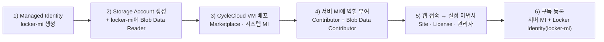
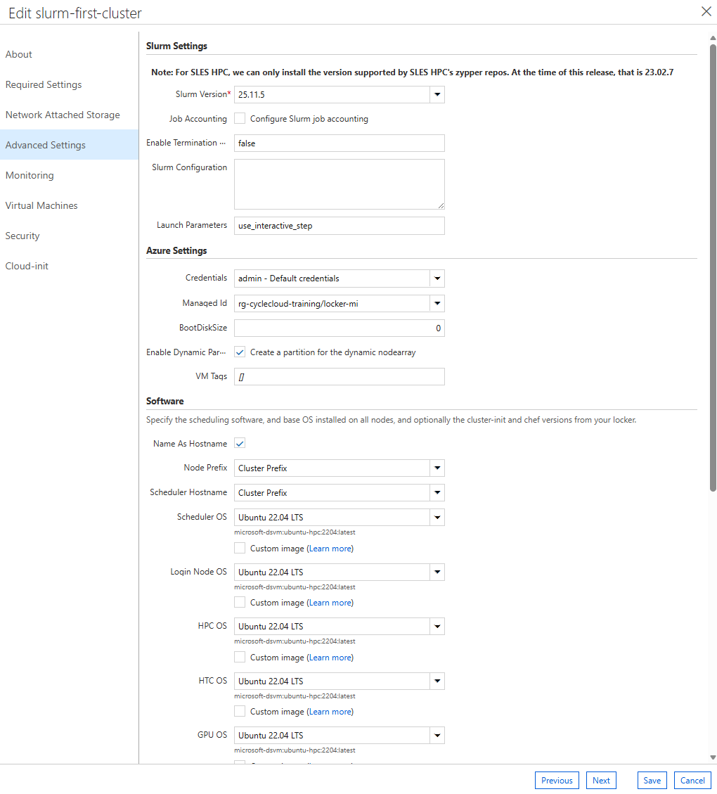

# 3. CycleCloud 신규 생성 및 최초 클러스터 구축 (First-Time Setup)

이 문서는 요청사항 **"Cycle cloud 신규 생성"**에 해당하며, **Azure Marketplace 이미지로 CycleCloud 서버를 신규 설치**하는 절차부터 포털 사이트 초기화, 첫 번째 Slurm 클러스터 구축·기동·검증까지 전체 흐름을 단계별로 안내합니다.

> 💡 본 실습 환경의 서버(`cc-server`)는 Bicep(IaC)으로 이미 배포되어 있습니다(→ [`infra/README.md`](../infra/README.md)). 아래 **3.1**은 MSP 담당자가 **포털에서 직접 CycleCloud를 신규 생성**하는 표준 절차이며, [Microsoft Learn 실습](https://learn.microsoft.com/training/modules/azure-cyclecloud-high-performance-computing/4-exercise-install-configure)을 기준으로 합니다. 이미 배포된 실습 환경만 사용한다면 3.1은 건너뛰고 **3.2**부터 진행하세요.

---

## 3.0 선제 요구 사항 (Prerequisites)

클러스터 생성 전 아래 두 가지를 점검합니다. 미충족 시 스테이징 단계에서 403/타임아웃으로 실패합니다.

### 3.0.1 서버 아웃바운드 엔드포인트 (잠긴 망)

인터넷이 차단된 환경이라도 아래 Azure 엔드포인트는 인증·VM 생성에 필수이므로 NSG **Service Tag**로 허용합니다.

| 용도 | 엔드포인트(FQDN) | Service Tag |
|------|------------------|-------------|
| VM 생성/관리 (ARM) | `management.azure.com` | `AzureResourceManager` |
| 인증 (Entra ID) | `login.microsoftonline.com` | `AzureActiveDirectory` |
| Locker 스토리지 | `*.blob.core.windows.net` | `Storage` (또는 Private Endpoint, §3.0.2) |
| 텔레메트리/모니터 | `dc.applicationinsights.azure.com`, `dc.applicationinsights.microsoft.com`, `dc.services.visualstudio.com`, `watson.telemetry.microsoft.com` | `AzureMonitor` |
| 가격 정보 | `ratecard.azure-api.net` | (FQDN 허용) |

- `management.azure.com`, `login.microsoftonline.com`은 Private Endpoint가 없으므로 반드시 Service Tag로 허용합니다.
- 소프트웨어·프로젝트 패키지(github, `packages.microsoft.com`, pypi 등)는 HTTPS 프록시 또는 오프라인(커스텀 이미지·내부 미러)으로 처리합니다.

관련 문서: [잠긴 망 실행](https://learn.microsoft.com/azure/cyclecloud/how-to/running-in-locked-down-network?view=cyclecloud-8) · [웹 프록시](https://learn.microsoft.com/azure/cyclecloud/how-to/running-behind-proxy?view=cyclecloud-8) · [Service Tag 목록](https://learn.microsoft.com/azure/virtual-network/service-tags-overview)

### 3.0.2 Locker 스토리지 도달성

Locker 스토리지가 공용 접근 차단(`publicNetworkAccess=Disabled`)이고 Private Endpoint가 없으면 서버·노드가 접근하지 못해 `HttpStatus-403`으로 실패합니다(진단: [11-트러블슈팅-로그.md](11-트러블슈팅-로그.md) §11.9).

1. **RBAC**: 서버 시스템 MI = `Storage Blob Data Contributor`, `locker-mi` = `Storage Blob Data Reader` (§3.1).
2. **컨테이너**: Locker 컨테이너(예: `cyclecloud`)를 미리 생성.
3. **네트워크** (택1):
   - **Private Endpoint(권장)**: blob용 PE를 노드/서버 VNet에 생성 → `privatelink.blob.core.windows.net` Private DNS zone 링크 → DNS zone group으로 A레코드 등록.
   - **Service Endpoint/방화벽**: 스토리지 네트워킹에서 해당 VNet/서브넷 허용.

---

## 3.1 1단계: CycleCloud 서버 신규 설치 (Marketplace 이미지)

**Azure Marketplace 이미지 기반 VM 배포**로 CycleCloud 애플리케이션을 신규 설치합니다.



### 구성요소 및 권한(RBAC) 개요 — 먼저 읽어보세요

구성요소와 권한은 아래 표를 기준으로 확인합니다.

#### (1) 구성요소별 설명

| 구성요소 | 무엇인가 | 무슨 작업을 하는가 |
|-----------|-----------|---------------------|
| **CycleCloud 서버 VM** (`cc-server`) | CycleCloud 애플리케이션(웹 포털)이 설치된 Linux VM. HPC 클러스터의 **오케스트레이터** | 포털 제공, 클러스터 정의 저장, 자동확장 판단, Azure API를 호출해 **노드 VM을 생성/삭제**, Locker에 프로젝트 업로드 |
| **서버의 시스템 할당 MI** | `cc-server` VM에 자동으로 연결된 Azure 아이덴티티(비밀번호·시크릿 없음) | 서버가 **Azure 리소스 관리**(노드 생성 등)와 **스토리지 접근** 시 인증에 사용 |
| **사용자 할당 MI** (`locker-mi`) | 서버와 **별개로 생성**해 스케줄러/계산 노드에 연결하는 아이덴티티 | 노드가 부팅 시 **Locker에서 프로젝트/cluster-init을 다운로드**할 때 인증에 사용 |
| **Storage Account (Locker)** (`cclkekwphusd3i`, 컨테이너 `cyclecloud`) | cluster-init 스크립트·프로젝트·템플릿(blob)을 보관하는 저장소 | 서버가 **업로드**하고, 노드가 부팅 시 **다운로드**하는 공유 저장소 역할 |
| **VNet / 서브넷** (`cc-vnet`) | 서버 서브넷 + 계산 노드용 `compute` 서브넷(10.0.1.0/24) | 서버와 노드의 네트워크 격리·통신 경로 제공 |
| **스케줄러 노드** | 클러스터 기동 시 `compute` 서브넷에 생성되는 헤드 노드 | `slurmctld` 실행, `/sched`·`/shared` 공유 파일시스템 제공, 작업 큐 관리 |
| **실행 노드** (hpc/htc) | 작업 제출 시 자동확장으로 생성되는 계산 노드 | 실제 Job 수행 후 유휴 시 자동 종료(비용 절감) |

#### (2) 권한(RBAC) 부여 요약 — 무엇을, 어디에, 왜

| 아이덴티티 | 부여 역할(Role) | 부여 범위(Scope) | 이 권한이 하는 일 |
|-------------|-----------------|-------------------|--------------------|
| **서버 시스템 MI** | **Contributor** | **구독**(또는 최소 대상 리소스 그룹) | 자동확장 시 노드 **VM·NIC·디스크·리소스그룹을 생성/삭제/관리** |
| **서버 시스템 MI** | **Storage Blob Data Contributor** | **Locker 스토리지 계정** | 서버가 Locker 컨테이너에 프로젝트/blob을 **읽기·쓰기(업로드)** |
| **`locker-mi` (UAMI)** | **Storage Blob Data Reader** | **Locker 스토리지 계정** | 노드가 Locker에서 프로젝트를 **읽기 전용 다운로드** |

공유 키(계정 키)/SAS가 비활성화된 환경에서는 관리 ID 기반 RBAC가 필요합니다.

### 1) Locker용 Managed Identity 생성 (User-Assigned)
포털 → **Managed Identities → + Create**

| 설정 | 값 |
|------|-----|
| Resource group | `cyclecloud-rg` (신규 생성) |
| Region | 클러스터를 배포할 리전 (예: Korea Central) |
| Name | `locker-mi` |

### 2) Locker용 Storage Account 생성 및 권한 부여
1. 포털 → **Storage accounts → + Create**: 위와 동일한 RG/리전, **Standard**, **LRS(로컬 중복)**.
2. 생성 후 **Access control (IAM) → + Add → Add role assignment**:
   - Role: **Storage Blob Data Reader**
   - Assign access to: **Managed Identity → `locker-mi`**
3. **Blob 컨테이너 생성**: **Containers → + Container** 로 컨테이너(예: `cyclecloud`)를 **미리 만들어 둡니다.**

> ⚠️ **컨테이너는 미리 생성하세요.** shared key가 비활성화된 스토리지에서 CycleCloud가 컨테이너를 자동 생성하려면 **Storage Blob Data Contributor** 권한이 필요합니다. 읽기 전용 `locker-mi`로 자동 생성하면 `Creating container (Http Status 403)` 오류가 발생합니다.
>
> ⚠️ **네트워크 도달성 확인**: 스토리지의 **Public network access가 Disabled**이고 **Private Endpoint가 없으면** Locker 생성/다운로드가 실패합니다. 공용 접근을 차단한 경우 **Private Endpoint + Private DNS** 를 구성합니다([1장 §1.6.2](01-환경-개요.md#162-private-endpoint--보안-스토리지db)).
>
> ⚠️ **Locker는 하나만 default로 등록하세요.** 동일 credential에 **Locker를 2개 이상 등록하면** `Multiple lockers found for credential ...` 오류가 발생합니다. **Azure 포털에서 스토리지만 삭제해도 CycleCloud 내부 Locker 레코드는 남으므로** 서버에서 별도로 정리해야 합니다([11장 §11.9](11-트러블슈팅-로그.md), `cyclecloud locker`에는 `remove` 명령이 없고 `list`/`show`만 있음).

### 3) CycleCloud VM 배포 (Marketplace)
1. 포털 검색 → **Azure CycleCloud** (Marketplace) → 기본 플랜으로 **Create**.
2. **Basics**: RG `cyclecloud-rg`, 
   VM 이름 `cyclecloud-vm`, 
   Region, 
   **Size `Standard_E4s_v3`** (최소 4 vCPU / 8GB RAM), 
   인증 방식 **SSH public key** 또는 비밀번호 방식, 
   Username `cc-admin`, 
   SSH 키페어 **새로 생성**(`cc-ssh-keys`).
3. **Disks**: OS 디스크 유형 **Premium SSD**.
4. **Networking**: 신규 VNet/서브넷 기본값 사용(CycleCloud 전용 서브넷 권장).
5. **Management**: **시스템 할당 관리 ID 사용(Enable system assigned managed identity)** 체크.
6. **Monitoring**: Boot diagnostics = **관리형 스토리지(권장)**.
7. **Review + Create → Create** → 팝업에서 **개인 키(`.pem`) 다운로드**(노드 접속용) 후 리소스 생성.

배포 완료 후 VM의 **공인 IP**를 확인합니다.

### 4) CycleCloud 서버 관리 ID에 역할 부여 (오케스트레이션 + Locker 쓰기)

VM 배포로 생성된 **서버(`cc-server`)의 시스템 할당 관리 ID**에 아래 두 역할을 부여합니다. 누락 시 3.2의 구독 등록(Validate Credential)이 실패하고 클러스터가 노드를 생성하지 못합니다.

| 역할(Role) | 부여 범위(Scope) | 부여 방법 |
|-----------|------------------|-----------|
| **Contributor** | **구독** (Subscriptions → 대상 구독 → Access control(IAM)) | + Add role assignment → Role: **Contributor** → Assign access to: **Managed identity → `cc-server`** |
| **Storage Blob Data Contributor** | **Locker 스토리지 계정** (Storage account → Access control(IAM)) | + Add role assignment → Role: **Storage Blob Data Contributor** → **Managed identity → `cc-server`** |

> 역할 반영에는 수 분이 걸릴 수 있습니다. Validate가 실패하면 잠시 후 재시도합니다.
>
> [MS 공식 문서](https://learn.microsoft.com/azure/cyclecloud/how-to/managed-identities)는 CycleCloud VM의 **시스템 할당 MI**에 **Contributor + Storage Blob Data Contributor** 를 부여하는 구성을 안내합니다. 프로덕션에서는 `Contributor`를 대상 RG 범위로 좁히거나 **커스텀 역할("CycleCloud Orchestrator Role")** 로 대체할 수 있습니다. **User-Assigned MI**를 서버에 연결한 경우 구독 등록 시 해당 MI의 **ClientID** 를 입력합니다(시스템 할당은 ClientID 공란).
>
> ⚠️ `locker-mi`(3.1 §1~2, Blob Data **Reader**)는 모든 계산 노드에 연결됩니다. 여기에 Contributor 같은 관리 권한을 부여하지 마세요.

---

## 3.2 2단계: CycleCloud 최초 접속 및 사이트 초기화 (Site Wizard)

서버 VM 배포 완료 후 최초 1회 진행하는 설정입니다.

### 1) 포털 접속 및 브라우저 경고 해제
- 웹 브라우저 접속: 생성된 VM의 IP로 https 접속 ('https://IP주소')
- 자체 서명 인증서 경고 발생 시: **[고급] → [계속 진행]** 클릭

### 2) 관리자 계정 생성 (Welcome Page)
- **Site Name**: 예) `KR-Training`
- **User ID / Password**: CycleCloud 포털 접속용 관리자 계정 생성 (예: `ccadmin`)

### 3) Azure Subscription (구독) 및 자격증명 등록

구독 등록에는 CycleCloud 서버 VM의 **시스템 할당 관리 ID(System-assigned Managed Identity)** 에 아래 권한이 필요합니다.

| 역할 | 부여 범위 | 목적 |
|------|-----------|------|
| **Contributor** | **구독**(또는 노드가 배포될 대상 RG) | CycleCloud가 노드 VM·NIC·디스크·RG를 생성/삭제/관리 |
| **Storage Blob Data Contributor** | **Locker 스토리지 계정** | 서버가 Locker 컨테이너에 프로젝트/blob을 업로드(읽기·쓰기) |

서버에 사용자 할당 관리 ID(User-assigned Managed Identity)를 연결한 경우 아래 단계에서 해당 ID를 사용할 수 있습니다.

| 설정 항목 | 입력 값 | 설명 |
|-----------|---------|------|
| **Account Name** | `training-sub` | 구독 등록 이름 |
| **Subscription ID** | `<YOUR_AZURE_SUBSCRIPTION_ID>` | Azure 구독 ID (`az account show --query id -o tsv`) |
| **Service Type** | **Managed Identity** 선택 | `cc-server` VM의 시스템 할당 관리 ID 사용 (비밀번호/시크릿 불필요) |
| **Default Region** | `Korea Central` (한국 중부) | 기본 클러스터 배포 리전 |
| **Resource Group** | `rg-cyclecloud-training` | 클러스터 노드가 생성될 Azure 리소스 그룹 |
| **Storage Account (Locker)** | `cclkekwphusd3i` (컨테이너 `cyclecloud`) | 프로젝트/템플릿 보관용 스토리지 |
| **Locker Identity** | `locker-mi` (신규 설치 시) | Locker 스토리지 접근용 관리 ID |

> ⚠️ **Validate Credential 전 확인**: 서버 VM(`cc-server`)의 관리 ID에 **Contributor(구독 범위)** + **Storage Blob Data Contributor(Locker 스토리지 범위)** 가 부여되어 있어야 합니다([3.1 §4](#4-cyclecloud-서버-관리-id에-역할-부여-오케스트레이션--locker-쓰기)). 할당 반영에 수 분이 걸릴 수 있어 Validate가 실패하면 잠시 후 재시도합니다.
>
> **Locker Identity(`locker-mi`)** 에는 3.1 §2에서 **Storage Blob Data Reader(스토리지 범위, 읽기 전용)** 를 부여했습니다.

- **Validate Credential** 클릭하여 권한 검증 성공 후 **Save** 클릭.

### 4) 포털 화면 구성 및 메뉴


| 메뉴 | 기능 |
|------|------|
| **Clusters** | 클러스터 목록, 신규 생성(`+`), 시작(Start), 중지(Terminate), 삭제(Delete) |
| **Nodes / Arrays** | 노드별 상태(Ready/Acquiring/Error), 로그 확인, 수동 Scale 제어 |
| **Settings** | 구독(Subscriptions), Locker(Storage), 사용자·권한(Users/Groups) 관리 |
| **Marketplace** | 빌트인 클러스터 템플릿(Slurm, OpenPBS, LSF, HTCondor 등) |

### 5) SSH 공개키 등록 (노드 접속용, 필수)

`cyclecloud connect`로 노드(`ccadmin`)에 SSH 접속하려면, **클러스터 생성 전에** 계정 프로필에 공개키를 등록해야 합니다. 등록된 공개키는 노드 부팅 시 `ccadmin`의 `authorized_keys`에 주입됩니다. 이 단계를 건너뛰면 모든 노드에 접속 키가 없어 `Permission denied (publickey)` 가 발생합니다.

1. **키페어 생성** — `cyclecloud connect`를 실행할 머신(서버 VM 또는 본인 워크스테이션)에서 1회.
   ```bash
   ssh-keygen -t rsa -b 4096 -f ~/.ssh/id_rsa -N ""
   cat ~/.ssh/id_rsa.pub
   ```
2. **공개키 등록** — 포털 우측 상단 사용자 메뉴 → **My Profile** → **SSH Public Keys** → `id_rsa.pub` 내용 붙여넣기 → **Save**.
3. **개인키 보관** — 개인키(`~/.ssh/id_rsa`)는 접속할 머신에 둡니다. `cyclecloud connect`는 기본적으로 이 경로(또는 ssh-agent, `-k` 옵션)를 사용합니다.

> ⚠️ 키 주입은 **노드 부팅 시점에만** 일어납니다. 이미 실행 중인 노드는 프로필 등록 후에도 소급 적용되지 않으므로, 해당 노드를 **Reimage/재기동**해야 키가 들어갑니다. 따라서 이 등록은 클러스터를 시작하기 전에 완료합니다.
>
> 서버 VM 배포 시 만든 Azure 관리자 키와는 별개입니다. 서버 배포용 키페어의 개인키를 서버 `~/.ssh/id_rsa`에 두고 같은 공개키를 위 프로필에 등록하면, 서버에서 바로 `cyclecloud connect`가 됩니다.

---

## 3.3 3단계: 최초 Slurm 클러스터 템플릿 상세 설정

사이트 초기화 후 첫 번째 HPC 클러스터를 구성합니다. 생성 전 리전/VM 계열 vCPU quota를 확인합니다.

참고: 5 페이지 https://learn.microsoft.com/en-us/training/modules/azure-cyclecloud-high-performance-computing/5-exercise-create-cluster/

1. 포털 좌측/상단 메뉴 **Clusters** 클릭 → **`+` (New Cluster)** 버튼 클릭.
2. 스케줄러 템플릿 중 **Slurm** 클릭.

> ⚠️ CycleCloud **8.7.0+** 또는 shared key 비활성화 환경에서는 Locker 접근에 관리 ID가 필요합니다([릴리스 노트](https://learn.microsoft.com/azure/cyclecloud/release-notes/8-7-0)). [MS Learn의 클러스터 생성 실습](https://learn.microsoft.com/training/modules/azure-cyclecloud-high-performance-computing/5-exercise-create-cluster)은 shared key 활성화 구성을 전제합니다.
> - **Locker Identity**(3.2 §3), 클러스터 **Managed Id**(본 절 §5 Advanced Settings → Azure Settings), 역할 부여(`locker-mi`=Reader 3.1 §2, 서버 MI=Contributor+Blob Data Contributor 3.1 §4)가 모두 필요합니다.
> - 누락 시 노드 부팅 중 CSE 다운로드가 실패합니다(`403 AuthorizationPermissionMismatch` 또는 `Unable to get managed identity ...`). → [11장 트러블슈팅](11-트러블슈팅-로그.md)

- **vCPU 쿼터 확인**: 포털 → **Subscriptions → (구독 선택) → 설정 → Usage + quotas**. Provider **Microsoft.Compute**, 배포 리전으로 필터 후 **Total Regional vCPUs** 및 사용할 VM 계열(예: **Standard Dv3/Dsv5 Family vCPUs**, **Standard FSv2 Family vCPUs**)의 가용 vCPU를 확인합니다. 부족하면 **Request quota increase**로 증설 요청합니다.
- **계산 노드 전용 서브넷 분리(권장)**: CycleCloud 서버 VM 서브넷과 **분리된 서브넷**에 계산 노드를 배치합니다. VNet → **Subnets → + Subnet**으로 전용 서브넷(예: `compute`)을 만들고, 대규모 클러스터일수록 **충분한 IP 대역**을 할당합니다.

### 탭별 상세 설정 항목

#### 1) About (기본 정보)
- **Cluster Name**: `slurm-first-cluster` (영문, 숫자, 하이픈만 사용)

#### 2) Required Settings (핵심 리소스 파라미터)
- **Region**: `Korea Central`
- **Scheduler VM Type**: `Standard_D4s_v5` (스케줄러/마스터 노드)
- **HPC VM Type**: `Standard_D4s_v5` (실습용) 또는 `Standard_HB176rs_v4` / `Standard_ND96amsr_A100_v4` (운영 GPU/HPC 노드)
- **Max HPC Cores**: `100` (HPC 파티션 자동확장 최대 코어 수)
- **Max HTC Cores**: `100` (HTC 파티션 자동확장 최대 코어 수)
- **Max VMs per Scaleset**: `40` — ⚠️ VMSS가 **InfiniBand fabric 경계**이므로, 이 값이 단일 **MPI 작업이 사용할 수 있는 최대 노드 규모**를 제한합니다.
- **Autoscale Enabled**: `Checked` (작업 제출 시 노드 자동 생성)

VM Type별 역할은 다음과 같습니다.

| VM Type | 역할 | 스케일 | 특징 / 권장 SKU |
|---------|------|--------|------------------|
| **Scheduler VM** | `slurmctld`(스케줄러 데몬) 구동 + `/shared`·`/sched` NFS 제공 | **1대 상주** (autoscale 아님) | 클러스터의 두뇌. 죽으면 스케줄링 전체 중단 → 안정 범용 SKU(`D4s_v5` 등) |
| **Login node VM** | 사용자가 SSH 접속해 **작업 제출(`sbatch`)·컴파일** | 0~N대 (옵션) | 계산은 안 함. scheduler 부하 분리용. 미지정 시 scheduler에서 직접 제출 |
| **HPC VM** | **긴밀결합(MPI) 작업**용 계산 노드 (파티션 `hpc`) | Autoscale | **InfiniBand/RDMA SKU**(`HB`,`HC`,`ND`). 단일 VMSS·근접배치로 저지연 통신 |
| **HTC VM** | **느슨결합(독립 태스크)** 계산 노드 (파티션 `htc`) | Autoscale | 일반 범용 SKU. IB 불필요. 노드 간 통신 적은 배치잡용 |
| **GPU VM** | **GPU 작업**용 계산 노드 (파티션 `gpu`) | Autoscale | `NC`,`ND`,`NG` 계열. `gres/gpu` 리소스로 GPU 개수 스케줄링 |
| **Dyn VM** (Dynamic) | **동적/임의 파티션** — 런타임에 유형을 유연하게 붙이는 노드 | Autoscale | 고정 파티션 대신 동적 노드 정의. 혼합 SKU·특수 워크로드용(대부분 실습에선 미사용) |

#### 3) Networking (네트워크 구성) — *현행 UI에서는 **Required Settings** 탭에 포함*
- **Virtual Network**: `cc-vnet`
- **Subnet ID / Subnet Name**: **`compute` (10.0.1.0/24)** *(스케줄러 및 계산 노드가 위치할 서브넷)* — 현재 UI에서는 Required Settings 탭의 **Subnet ID** 항목으로 선택합니다.
- **Scheduler Public IP**: `Checked` (포털을 통하지 않고 스케줄러 노드에 직접 SSH 접근할 경우)

서브넷 분리·IP 사이징·Scheduler Public IP 기준은 [1장 §1.6 네트워크·보안 아키텍처](01-환경-개요.md#16-네트워크보안-아키텍처-개념)를 참고하세요.

#### 4) Network Attached Storage (공유 NFS)
- **NFS Type**: **`Builtin`** — 스케줄러 노드가 `/shared` 및 `/sched` 마운트를 직접 제공
- **Size (GB)**: 기본 `100` (필요 시 조정)

#### 5) Advanced Settings 탭 (현행 UI 기준 — 각 항목 설명)

**Edit → Advanced Settings** 화면입니다.



**■ Slurm Settings**

| 항목 | 설명 |
|------|------|
| **Slurm Version** | 설치할 Slurm 버전(예: `25.11.5`). 노드 이미지에 맞는 버전이 제안됩니다. |
| **Job Accounting** | `sacct` 기반 작업 회계 활성화 체크박스. 이미 만든 클러스터는 재시작 필요(→ [7장](07-Job-Accounting-설정.md)). |
| **Enable Termination Protection** | 노드 우발적 삭제 방지(기본 `false`). |
| **Slurm Configuration** | `slurm.conf`에 **병합할 커스텀 설정**을 직접 입력. 예: `SuspendExcParts=hpc`, `AccountingStorageTRES=gres/gpu`. 여기 넣으면 **템플릿에 영구 반영**되어 `azslurm scale`/재시작에도 유지됩니다(→ [4장](04-노드-증감설-사이즈변경.md)). |
| **Launch Parameters** | Slurm 실행 파라미터(예: `use_interactive_step`). |

**■ Azure Settings (아이덴티티)**

`Credentials`와 `Managed Id`는 서로 다른 필드이며 둘 다 필요합니다.

| 항목 | 무엇인가 / 하는 일 | 필요 권한 |
|------|--------------------|-----------|
| **Credentials** | **구독 자격증명** = **3.2 §3**에서 등록한 구독(예: `admin - Default credentials`). 뒤에서 **cc-server의 관리 ID**로 인증하며, **CycleCloud 서버가 노드 VM을 생성/삭제**하고 **프로젝트를 Locker에 업로드**할 때 사용(control plane). | **Contributor**(구독) + **Storage Blob Data Contributor**(스토리지) — **3.1 §4** |
| **Managed Id** | **노드에 물리적으로 붙는 사용자 할당 MI**(예: `rg-cyclecloud-training/locker-mi`). 생성된 **노드가 부팅 시 Locker에서 프로젝트를 다운로드**할 때 사용(data plane). **8.7+/shared key 비활성화 환경에서는 필수**. | **Storage Blob Data Reader**(스토리지) — **3.1 §2** |
| **BootDiskSize** | 노드 OS(부팅) 디스크 크기(GB). `0` = 실제 64GB(→ [4.10](04-노드-증감설-사이즈변경.md)). | |
| **Enable Dynamic Partition** | 동적 노드배열(dynamic)용 파티션 생성(기본 체크). | |
| **VM Tags** | 노드 VM에 부여할 태그(비용 추적·거버넌스용). | |

> ⚠️ **Managed Id 드롭다운 주의**: 과거 실습에서 만든 **다른 RG의 오래된 관리 ID**가 함께 보일 수 있습니다. 반드시 3.1에서 만든 **`locker-mi`**(현재 스토리지에 Blob Data Reader가 부여된 것)를 선택하세요. 잘못 선택하면 노드 다운로드가 `403`으로 실패합니다(→ [11장](11-트러블슈팅-로그.md)).

**■ Software (노드 이미지·명명)**

| 항목 | 설명 |
|------|------|
| **Name As Hostname / Node Prefix / Scheduler Hostname** | 노드 호스트명 규칙(기본 클러스터 접두사 사용). |
| **Scheduler / Login / HPC / HTC / GPU OS** | 노드 유형별 **OS 이미지** 선택(기본 `Ubuntu 22.04 LTS`, `microsoft-dsvm:ubuntu-hpc:2204:latest`). 커스텀 이미지 사용 시 각 항목의 **Custom image** 체크. |

#### 6) 그 외 탭 (Monitoring · Virtual Machines · Security · Cloud-init)

- **Monitoring**: 노드 모니터링/로그 수집 옵션.
- **Virtual Machines**: 노드배열별 VM 세부 옵션 검토.
- **Security**: 보안 옵션(ReturnProxy, 암호화 등).
  - **SSH 공개키(관리자 키)**: 클러스터 생성 폼에는 별도 Keypair 입력란이 **없습니다**. 스케줄러 노드에 직접 SSH 하려면 포털 우상단 **사용자 프로필 → SSH Public Keys**에 관리자 공개키를 등록하세요(클러스터 폼이 아님).
- **Cloud-init**: 노드 부팅 시 실행할 스크립트 지정 탭. 변경이 없으면 그대로 진행.
  > ⚠️ 운영 중 cloud-init 수정은 노드 재기동을 유발할 수 있습니다(→ [4장](04-노드-증감설-사이즈변경.md)). 노드 커스터마이징은 **cluster-init** 사용을 권장합니다(→ [6장](06-cluster-init-및-커스텀-스크립트.md)).

설정 완료 후 오른쪽 하단 **Save** 클릭. (저장 직후 클러스터는 **`Off`** 상태로 등록됨)

---

## 3.4 4단계: 예산 경고 설정 및 클러스터 최초 기동 (Start)

### 예산 경고(Budget Alert) 설정 — 권장
클러스터 운영 비용이 예산에 도달하면 알림을 받도록, 기동 전에 경고를 설정해 둡니다. 클러스터 페이지에서 **Create new alert** 링크 클릭 후 아래 값을 지정하고 **Save**:

| 설정 | 값 (예시) |
|------|-----------|
| **Budget** | `$100.00` |
| **Per** | `Month` |
| **Send notification** | `Enabled` |
| **Recipients** | `cc-admin@contoso.com` |

### 클러스터 기동
1. 포털 **Clusters** 목록에서 `slurm-first-cluster` 선택.
2. 상단 **Start** 버튼 클릭 → 확인 팝업에서 **OK**.

### 노드 프로비저닝 상태 라이프사이클
```
[Off] ──▶ [Acquiring] ──▶ [Preparing] ──▶ [Ready]
 (중지)     (Azure VM 생성)   (OS 부팅/설정)   (작업 수용 가능)
```

- **`Off`**: 노드 VM이 존재하지 않는 초기 중지 상태
- **`Acquiring`**: CycleCloud가 Azure API를 호출하여 NIC, Disk, VM 프로비저닝 진행 (약 1~2분)
- **`Preparing`**: VM 부팅 후 `jetpack` 에이전트 및 Slurm 데몬(`slurmctld`) 구성 (약 2~3분)
- **`Ready`**: 스케줄러 노드가 정상 기동되어 작업 제출을 받아들일 준비 완료

CLI 확인 명령어 (Master Server에서 실행):
```bash
cyclecloud show_cluster slurm-first-cluster
cyclecloud show_nodes -c slurm-first-cluster
```

---

## 3.5 5단계: 스케줄러 접속 및 최초 작업(Job) 실행 검증

클러스터 상태가 **`Ready`**가 되면 최초 작업 실행 테스트를 진행합니다.

### 1) 스케줄러 노드 SSH 접속
```bash
# CycleCloud CLI를 사용하여 스케줄러 노드 세션 연결
cyclecloud connect scheduler -c slurm-first-cluster
```

> `Permission denied (publickey)` 가 나면 [§3.2 5) SSH 공개키 등록](#5-ssh-공개키-등록-노드-접속용-필수)을 건너뛴 것입니다. 프로필에 공개키를 등록한 뒤 노드를 재기동해야 접속됩니다.

### 2) Slurm 스케줄러 상태 및 파티션 확인
```bash
sinfo
# Expected Output:
# PARTITION AVAIL  TIMELIMIT  NODES  STATE NODELIST
# hpc*         up   infinite    100  idle~ slurm-first-cluster-hpc-[1-100]
```

### 3) 대화형 작업 실행 (Interactive Job Test)
```bash
# 계산 노드 1대를 즉시 할당받아 hostname 확인 (자동확장 동작)
srun -N 1 hostname
```

### 4) 비동기 배치 작업 스크립트 작성 및 제출 (`sbatch`)
```bash
cat << 'EOF' > test_first_job.sh
#!/bin/bash
#SBATCH --job-name=first_test
#SBATCH --output=first_test_%j.out
#SBATCH --nodes=2
#SBATCH --ntasks-per-node=1

echo "=========================================="
echo " CycleCloud Slurm Cluster Test Job"
echo " Job ID: $SLURM_JOB_ID"
echo " Running on nodes: $SLURM_JOB_NODELIST"
echo "=========================================="
srun hostname
EOF

# 작업 제출
sbatch test_first_job.sh

# 작업 큐 상태 모니터링
squeue

# 실행 결과 출력 확인
cat first_test_*.out
```

---

## 3.6 CLI를 이용한 최초 클러스터 원클릭 구축 (대안)

포털 GUI 대신 CLI 명령어로 최초 클러스터를 원클릭 구축하는 방법입니다. CLI는 서버 VM(`cc-server`)에 기본 설치되어 있습니다.

```bash
# 0) CLI 인증 초기화 (최초 1회) — SSH 접속 또는 Azure Portal '명령 실행'
ssh -i keys/cyclecloud_rsa azureadmin@<서버_IP>
cyclecloud initialize
#  CycleCloud URL: https://localhost (또는 서버 IP), Username / Password 입력

# Locker·클러스터 목록 확인
cyclecloud locker list
cyclecloud list_clusters

# 1) 노드 접속용 SSH 공개키 등록 (최초 1회) — 미등록 시 노드 접속 불가
#    프로필에 등록된 공개키가 부팅 시 노드에 주입됨 (상세: §3.2 5)
ssh-keygen -t rsa -b 4096 -f ~/.ssh/id_rsa -N ""
#    출력된 ~/.ssh/id_rsa.pub 를 포털 My Profile → SSH Public Keys 에 등록

# 2) 파티션 및 규격 정의 파일 (params.json)
cat << 'EOF' > params.json
{
  "Region": "koreacentral",
  "SubnetId": "cyclecloud/ccw-vnet/ccw-compute-subnet",
  "MaxHPCExecuteCoreCount": 100,
  "HPCMachineType": "Standard_D4s_v5",
  "SchedulerMachineType": "Standard_D4s_v5"
}
EOF

# 3) 클러스터 생성
cyclecloud create_cluster Slurm slurm-first-cluster -p params.json

# 4) 클러스터 기동
cyclecloud start_cluster slurm-first-cluster
```

> ⚠️ **SubnetId 는 Locker Private Endpoint에 도달 가능한 서브넷**이어야 합니다. 노드가 서버·Locker와 **다른 VNet**(피어링·PE·DNS 없음)에 배치되면 부팅 중 jetpack 다운로드가 `could not install jetpack` / `403`으로 실패합니다. 노드 서브넷은 **서버와 동일 VNet**(또는 PE·DNS가 연결된 피어링 VNet)에 두세요. 주소공간이 겹치면 피어링이 불가하므로 처음부터 서버 VNet의 계산 서브넷을 사용하는 것이 안전합니다.

---

## 3.7 클러스터 종료 및 리소스 정리 (Clean Up)

평가·검증이 끝났다면 불필요한 비용을 막기 위해 클러스터를 종료하고 리소스를 정리합니다.

1. 클러스터 페이지에서 **Terminate** 링크 클릭 → 확인 팝업 **OK**. (헤드 노드 VM 등 자동 프로비저닝된 리소스가 해제되며 약 5분 소요)
2. 실습 환경 전체를 삭제하려면 리소스 그룹을 삭제합니다.
   - **`cyclecloud-rg`** (서버·VNet 등) 삭제 — 포털 리소스 그룹 페이지 → **Delete resource group** → 이름 입력 후 삭제.
   - ⚠️ **클러스터 이름으로 시작하는 별도 리소스 그룹**(예: `slurm-first-cluster-...`)도 함께 삭제하세요. 여기에 클러스터가 사용한 **디스크 리소스**가 별도로 존재합니다.

> ⚠️ **Terminate ≠ 재부팅**: Terminate는 노드를 **삭제**하므로 단순 재부팅 목적으로는 쓰지 마세요. GPU/RI 노드는 재획득(용량) 실패 위험이 있으므로, 재시작이 필요하면 할당을 유지하는 in-place 재부팅을 사용합니다(→ [4장 노드 재부팅](04-노드-증감설-사이즈변경.md), [1장 운영 지침](01-환경-개요.md)).

---

다음 단계: [4. 노드 증설/감설 및 노드 사이즈 변경](04-노드-증감설-사이즈변경.md)
