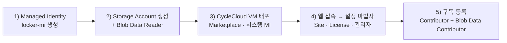

# 3. CycleCloud 신규 생성 및 최초 클러스터 구축 (First-Time Setup)

이 문서는 요청사항 **"Cycle cloud 신규 생성"**에 해당하며, **Azure Marketplace 이미지로 CycleCloud 서버를 신규 설치**하는 절차부터 포털 사이트 초기화, 첫 번째 Slurm 클러스터 구축·기동·검증까지 전체 흐름을 단계별로 안내합니다.

> 💡 본 실습 환경의 서버(`cc-server`)는 Bicep(IaC)으로 이미 배포되어 있습니다(→ [`infra/README.md`](../infra/README.md)). 아래 **3.1**은 MSP 담당자가 **포털에서 직접 CycleCloud를 신규 생성**하는 표준 절차이며, [Microsoft Learn 실습](https://learn.microsoft.com/training/modules/azure-cyclecloud-high-performance-computing/4-exercise-install-configure)을 기준으로 합니다. 이미 배포된 실습 환경만 사용한다면 3.1은 건너뛰고 **3.2**부터 진행하세요.

---

## 3.1 1단계: CycleCloud 서버 신규 설치 (Marketplace 이미지)

Microsoft 권장 방식인 **Azure Marketplace 이미지 기반 VM 배포**로 CycleCloud 애플리케이션을 신규 설치합니다. CycleCloud는 Azure 연결만 되면 어디서든 설치·운영할 수 있는 Linux 기반 웹 애플리케이션입니다.



### 1) Locker용 Managed Identity 생성 (User-Assigned)
포털 → **Managed Identities → + Create**
| 설정 | 값 |
|------|-----|
| Resource group | `cyclecloud-rg` (신규 생성) |
| Region | 클러스터를 배포할 리전 (예: Korea Central) |
| Name | `locker-mi` |

### 2) Locker용 Storage Account 생성 및 권한 부여
1. 포털 → **Storage accounts → + Create**: 위와 동일한 RG/리전, **Standard**, **LRS(로컬 중복)**.
2. 생성 후 **Access control (IAM) → + Add → Add role assignment**:
   - Role: **Storage Blob Data Reader**
   - Assign access to: **Managed Identity → `locker-mi`**
> 이 스토리지 계정이 cluster-init·프로젝트 파일을 보관하는 **Locker**가 됩니다.

### 3) CycleCloud VM 배포 (Marketplace)
1. 포털 검색 → **Azure CycleCloud** (Marketplace) → 기본 플랜으로 **Create**.
2. **Basics**: RG `cyclecloud-rg`, 
   VM 이름 `cyclecloud-vm`, 
   Region, 
   **Size `Standard_E4s_v3`** (최소 4 vCPU / 8GB RAM), 
   인증 방식 **SSH public key** 또는 비밀번호 방식, 
   Username `cc-admin`, 
   SSH 키페어 **새로 생성**(`cc-ssh-keys`).
3. **Disks**: OS 디스크 유형 **Premium SSD**.
4. **Networking**: 신규 VNet/서브넷 기본값 사용(CycleCloud 전용 서브넷 권장).
5. **Management**: **시스템 할당 관리 ID 사용(Enable system assigned managed identity)** 체크.
6. **Monitoring**: Boot diagnostics = **관리형 스토리지(권장)**.
7. **Review + Create → Create** → 팝업에서 **개인 키(`.pem`) 다운로드**(노드 접속용) 후 리소스 생성.
> 배포 완료까지 약 1분 소요됩니다. 완료 후 VM의 **공인 IP**를 확인해 둡니다.

---

## 3.2 2단계: CycleCloud 최초 접속 및 사이트 초기화 (Site Wizard)

서버 VM 배포 완료 후 최초 1회 진행하는 설정입니다.

### 1) 포털 접속 및 브라우저 경고 해제
- 웹 브라우저 접속: 생성된 VM의 IP로 https 접속 ('https://IP주소')
- 자체 서명 인증서 경고 발생 시: **[고급] → [계속 진행]** 클릭

### 2) 관리자 계정 생성 (Welcome Page)
- **Site Name**: 예) `KR-Training`
- **User ID / Password**: CycleCloud 포털 접속용 관리자 계정 생성 (예: `ccadmin`)

### 3) Azure Subscription (구독) 및 자격증명 등록

Azure 구독 내 리소스를 생성하고 관리하기 위해 Azure CycleCloud에는 일정 수준의 권한이 필요합니다.

가장 간단한 방법은 CycleCloud 애플리케이션이 설치된 Azure VM의 시스템 할당 관리 ID(System-assigned Managed Identity) 에 대해 다음 역할을 구독 범위에 부여하는 것입니다.

Contributor
Storage Blob Data Contributor

또는 사용자 할당 관리 ID(User-assigned Managed Identity) 를 생성하여 해당 VM에 연결한 후, 아래 단계에서 해당 ID를 사용할 수도 있습니다.


| 설정 항목 | 입력 값 | 설명 |
|-----------|---------|------|
| **Account Name** | `training-sub` | 구독 등록 이름 |
| **Subscription ID** | `<YOUR_AZURE_SUBSCRIPTION_ID>` | Azure 구독 ID (`az account show --query id -o tsv`) |
| **Service Type** | **Managed Identity** 선택 | `cc-server` VM의 시스템 할당 관리 ID 사용 (비밀번호/시크릿 불필요) |
| **Default Region** | `Korea Central` (한국 중부) | 기본 클러스터 배포 리전 |
| **Resource Group** | `rg-cyclecloud-training` | 클러스터 노드가 생성될 Azure 리소스 그룹 |
| **Storage Account (Locker)** | `cclkekwphusd3i` (컨테이너 `cyclecloud`) | 프로젝트/템플릿 보관용 스토리지 |
| **Locker Identity** | `locker-mi` (신규 설치 시) | Locker 스토리지 접근용 관리 ID |

> ⚠️ **사전 권한 부여 필수**: **Validate Credential** 전에, 대상 구독의 **Access control(IAM)**에서 생성된 VM의 (cyclecloud-vm - 서버 VM의 시스템 할당 관리 ID)에 **Contributor** 와 **Storage Blob Data Contributor** 역할을 할당해야 합니다. 할당 직후에는 반영까지 수 분이 걸릴 수 있어 Validate가 실패하면 잠시 후 재시도합니다. (최소 권한이 필요하면 커스텀 RBAC 역할로 대체 가능)

- **Validate Credential** 클릭하여 권한 검증 성공 후 **Save** 클릭.

---

## 3.3 3단계: 최초 Slurm 클러스터 템플릿 상세 설정

사이트 초기화가 완료되면 첫 번째 HPC 클러스터를 구성합니다.
클러스터를 구성하기 전에 생성에 필요한 컴퓨팅 자원의 quota가 충분한지 확인이 필요합니다. 


1. 포털 좌측/상단 메뉴 **Clusters** 클릭 → **`+` (New Cluster)** 버튼 클릭.
2. 스케줄러 템플릿 중 **Slurm** 클릭.

> **사전 준비 (Learn Task 1 — 클러스터 생성 전 확인)**
>
> **① vCPU 쿼터 확인** — 포털 → **Subscriptions → (구독 선택) → 설정 → Usage + quotas**. Provider **Microsoft.Compute**, 배포 리전으로 필터 후 **Total Regional vCPUs** 및 사용할 VM 계열(예: **Standard Dv3/Dsv5 Family vCPUs**, **Standard FSv2 Family vCPUs**)의 가용 vCPU가 아래 `Max ... Cores` 설정을 감당하는지 확인합니다. 부족하면 **Request quota increase**로 증설 요청. (Job을 실행하지 않는 검증 목적이면 쿼터가 없어도 클러스터 생성은 되지만, 자동확장 placeholder 노드가 미리 생성되지 않아 화면이 실습 스크린샷과 다를 수 있습니다.)
>
> **② 계산 노드 전용 서브넷 분리(권장)** — CycleCloud 서버 VM 서브넷과 **분리된 서브넷**에 계산 노드를 배치합니다. VNet → **Subnets → + Subnet**으로 전용 서브넷(예: `compute`)을 만들고, 대규모 클러스터일수록 **충분한 IP 대역**을 할당합니다.

### 탭별 상세 설정 항목

#### 1) About (기본 정보)
- **Cluster Name**: `slurm-first-cluster` (영문, 숫자, 하이픈만 사용)

#### 2) Required Settings (핵심 리소스 파라미터)
- **Region**: `Korea Central`
- **Scheduler VM Type**: `Standard_D4s_v5` (스케줄러/마스터 노드)
- **HPC VM Type**: `Standard_D4s_v5` (실습용) 또는 `Standard_HB176rs_v4` / `Standard_ND96amsr_A100_v4` (운영 GPU/HPC 노드)
- **Max HPC Cores**: `100` (HPC 파티션 자동확장 최대 코어 수)
- **Max HTC Cores**: `100` (HTC 파티션 자동확장 최대 코어 수)
- **Max VMs per Scaleset**: `40` — ⚠️ VMSS가 **InfiniBand fabric 경계**이므로, 이 값이 단일 **MPI 작업이 사용할 수 있는 최대 노드 규모**를 제한합니다.
- **Autoscale Enabled**: `Checked` (작업 제출 시 노드 자동 생성)

#### 3) Networking (네트워크 구성)
- **Virtual Network**: `cc-vnet`
- **Subnet Name**: **`compute` (10.0.1.0/24)** *(스케줄러 및 계산 노드가 위치할 서브넷)*
- **Scheduler Public IP**: `Checked` (포털을 통하지 않고 스케줄러 노드에 직접 SSH 접근할 경우)

#### 4) Network Attached Storage (공유 NFS)
- **NFS Type**: **`Builtin`** — 스케줄러 노드가 `/shared` 및 `/sched` 마운트를 직접 제공
- **Size (GB)**: 기본 `100` (필요 시 조정)

#### 5) Advanced Settings / Cloud-init
- **Advanced Settings**: 기본값 검토 후 진행(특별한 요구 없으면 변경 불필요).
- **Cloud-init**: 노드 부팅 시 실행할 스크립트를 지정하는 탭. 변경이 없으면 그대로 **Save**.
  > ⚠️ 운영 중 cloud-init 수정은 노드 재기동을 유발할 수 있습니다(→ [4장](04-노드-증감설-사이즈변경.md)). 노드 커스터마이징은 **cluster-init** 사용을 권장합니다(→ [6장](06-cluster-init-및-커스텀-스크립트.md)).

#### 6) Storage & 보안
- **Locker**: `cclkekwphusd3i` (Storage Account)
- **Keypair**: 등록된 관리자 SSH 공개키 지정

설정 완료 후 오른쪽 하단 **Save** 클릭. (저장 직후 클러스터는 **`Off`** 상태로 등록됨)

---

## 3.4 4단계: 예산 경고 설정 및 클러스터 최초 기동 (Start)

### 예산 경고(Budget Alert) 설정 — 권장
클러스터 운영 비용이 예산에 도달하면 알림을 받도록, 기동 전에 경고를 설정해 둡니다. 클러스터 페이지에서 **Create new alert** 링크 클릭 후 아래 값을 지정하고 **Save**:

| 설정 | 값 (예시) |
|------|-----------|
| **Budget** | `$100.00` |
| **Per** | `Month` |
| **Send notification** | `Enabled` |
| **Recipients** | `cc-admin@contoso.com` |

### 클러스터 기동
1. 포털 **Clusters** 목록에서 `slurm-first-cluster` 선택.
2. 상단 **Start** 버튼 클릭 → 확인 팝업에서 **OK**.

### 노드 프로비저닝 상태 라이프사이클
```
[Off] ──▶ [Acquiring] ──▶ [Preparing] ──▶ [Ready]
 (중지)     (Azure VM 생성)   (OS 부팅/설정)   (작업 수용 가능)
```

- **`Off`**: 노드 VM이 존재하지 않는 초기 중지 상태
- **`Acquiring`**: CycleCloud가 Azure API를 호출하여 NIC, Disk, VM 프로비저닝 진행 (약 1~2분)
- **`Preparing`**: VM 부팅 후 `jetpack` 에이전트 및 Slurm 데몬(`slurmctld`) 구성 (약 2~3분)
- **`Ready`**: 스케줄러 노드가 정상 기동되어 작업 제출을 받아들일 준비 완료

CLI 확인 명령어 (Master Server에서 실행):
```bash
cyclecloud show_cluster slurm-first-cluster
cyclecloud show_nodes -c slurm-first-cluster
```

---

## 3.5 5단계: 스케줄러 접속 및 최초 작업(Job) 실행 검증

클러스터 상태가 **`Ready`**가 되면 최초 작업 실행 테스트를 진행합니다.

### 1) 스케줄러 노드 SSH 접속
```bash
# CycleCloud CLI를 사용하여 스케줄러 노드 세션 연결
cyclecloud connect scheduler -c slurm-first-cluster
```

### 2) Slurm 스케줄러 상태 및 파티션 확인
```bash
sinfo
# Expected Output:
# PARTITION AVAIL  TIMELIMIT  NODES  STATE NODELIST
# hpc*         up   infinite    100  idle~ slurm-first-cluster-hpc-[1-100]
```

### 3) 대화형 작업 실행 (Interactive Job Test)
```bash
# 계산 노드 1대를 즉시 할당받아 hostname 확인 (자동확장 동작)
srun -N 1 hostname
```

### 4) 비동기 배치 작업 스크립트 작성 및 제출 (`sbatch`)
```bash
cat << 'EOF' > test_first_job.sh
#!/bin/bash
#SBATCH --job-name=first_test
#SBATCH --output=first_test_%j.out
#SBATCH --nodes=2
#SBATCH --ntasks-per-node=1

echo "=========================================="
echo " CycleCloud Slurm Cluster Test Job"
echo " Job ID: $SLURM_JOB_ID"
echo " Running on nodes: $SLURM_JOB_NODELIST"
echo "=========================================="
srun hostname
EOF

# 작업 제출
sbatch test_first_job.sh

# 작업 큐 상태 모니터링
squeue

# 실행 결과 출력 확인
cat first_test_*.out
```

---

## 3.6 CLI를 이용한 최초 클러스터 원클릭 구축 (대안)

포털 GUI 대신 CLI 명령어로 최초 클러스터를 원클릭 구축하는 방법입니다.

```bash
# 1) 파티션 및 규격 정의 파일 (params.json)
cat << 'EOF' > params.json
{
  "Region": "koreacentral",
  "SubnetId": "rg-cyclecloud-training/cc-vnet/compute",
  "MaxHPCExecuteCoreCount": 100,
  "HPCMachineType": "Standard_D4s_v5",
  "SchedulerMachineType": "Standard_D4s_v5"
}
EOF

# 2) 클러스터 생성
cyclecloud create_cluster Slurm slurm-first-cluster -p params.json

# 3) 클러스터 기동
cyclecloud start_cluster slurm-first-cluster
```

---

## 3.7 클러스터 종료 및 리소스 정리 (Clean Up)

평가·검증이 끝났다면 불필요한 비용을 막기 위해 클러스터를 종료하고 리소스를 정리합니다.

1. 클러스터 페이지에서 **Terminate** 링크 클릭 → 확인 팝업 **OK**. (헤드 노드 VM 등 자동 프로비저닝된 리소스가 해제되며 약 5분 소요)
2. 실습 환경 전체를 삭제하려면 리소스 그룹을 삭제합니다.
   - **`cyclecloud-rg`** (서버·VNet 등) 삭제 — 포털 리소스 그룹 페이지 → **Delete resource group** → 이름 입력 후 삭제.
   - ⚠️ **클러스터 이름으로 시작하는 별도 리소스 그룹**(예: `slurm-first-cluster-...`)도 함께 삭제하세요. 여기에 클러스터가 사용한 **디스크 리소스**가 별도로 존재합니다.

> ⚠️ **Terminate ≠ 재부팅**: Terminate는 노드를 **삭제**하므로 단순 재부팅 목적으로는 쓰지 마세요. GPU/RI 노드는 재획득(용량) 실패 위험이 있으므로, 재시작이 필요하면 할당을 유지하는 in-place 재부팅을 사용합니다(→ [4장 노드 재부팅](04-노드-증감설-사이즈변경.md), [1장 운영 지침](01-환경-개요.md)).

---

다음 단계: [4. 노드 증설/감설 및 노드 사이즈 변경](04-노드-증감설-사이즈변경.md)
