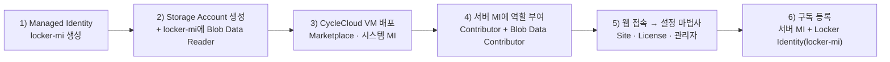

# 3. CycleCloud 신규 생성 및 최초 클러스터 구축 (First-Time Setup)

이 문서는 요청사항 **"Cycle cloud 신규 생성"**에 해당하며, **Azure Marketplace 이미지로 CycleCloud 서버를 신규 설치**하는 절차부터 포털 사이트 초기화, 첫 번째 Slurm 클러스터 구축·기동·검증까지 전체 흐름을 단계별로 안내합니다.

> 💡 본 실습 환경의 서버(`cc-server`)는 Bicep(IaC)으로 이미 배포되어 있습니다(→ [`infra/README.md`](../infra/README.md)). 아래 **3.1**은 MSP 담당자가 **포털에서 직접 CycleCloud를 신규 생성**하는 표준 절차이며, [Microsoft Learn 실습](https://learn.microsoft.com/training/modules/azure-cyclecloud-high-performance-computing/4-exercise-install-configure)을 기준으로 합니다. 이미 배포된 실습 환경만 사용한다면 3.1은 건너뛰고 **3.2**부터 진행하세요.

---

## 3.1 1단계: CycleCloud 서버 신규 설치 (Marketplace 이미지)

Microsoft 권장 방식인 **Azure Marketplace 이미지 기반 VM 배포**로 CycleCloud 애플리케이션을 신규 설치합니다. CycleCloud는 Azure 연결만 되면 어디서든 설치·운영할 수 있는 Linux 기반 웹 애플리케이션입니다.



### 구성요소 및 권한(RBAC) 개요 — 먼저 읽어보세요

본 실습은 아래 구성요소로 이루어집니다. 각 구성요소가 **무엇이고, 어떤 작업을 수행하며, 어떤 권한을 어디에 부여하는지**를 먼저 이해하면 이후 GUI/CLI 단계가 명확해집니다.

#### (1) 구성요소별 설명

| 구성요소 | 무엇인가 | 무슨 작업을 하는가 |
|-----------|-----------|---------------------|
| **CycleCloud 서버 VM** (`cc-server`) | CycleCloud 애플리케이션(웹 포털)이 설치된 Linux VM. HPC 클러스터의 **오케스트레이터** | 포털 제공, 클러스터 정의 저장, 자동확장 판단, Azure API를 호출해 **노드 VM을 생성/삭제**, Locker에 프로젝트 업로드 |
| **서버의 시스템 할당 MI** | `cc-server` VM에 자동으로 연결된 Azure 아이덴티티(비밀번호·시크릿 없음) | 서버가 **Azure 리소스 관리**(노드 생성 등)와 **스토리지 접근** 시 인증에 사용 |
| **사용자 할당 MI** (`locker-mi`) | 서버와 **별개로 생성**해 스케줄러/계산 노드에 연결하는 아이덴티티 | 노드가 부팅 시 **Locker에서 프로젝트/cluster-init을 다운로드**할 때 인증에 사용 |
| **Storage Account (Locker)** (`cclkekwphusd3i`, 컨테이너 `cyclecloud`) | cluster-init 스크립트·프로젝트·템플릿(blob)을 보관하는 저장소 | 서버가 **업로드**하고, 노드가 부팅 시 **다운로드**하는 공유 저장소 역할 |
| **VNet / 서브넷** (`cc-vnet`) | 서버 서브넷 + 계산 노드용 `compute` 서브넷(10.0.1.0/24) | 서버와 노드의 네트워크 격리·통신 경로 제공 |
| **스케줄러 노드** | 클러스터 기동 시 `compute` 서브넷에 생성되는 헤드 노드 | `slurmctld` 실행, `/sched`·`/shared` 공유 파일시스템 제공, 작업 큐 관리 |
| **실행 노드** (hpc/htc) | 작업 제출 시 자동확장으로 생성되는 계산 노드 | 실제 Job 수행 후 유휴 시 자동 종료(비용 절감) |

#### (2) 권한(RBAC) 부여 요약 — 무엇을, 어디에, 왜

| 아이덴티티 | 부여 역할(Role) | 부여 범위(Scope) | 이 권한이 하는 일 |
|-------------|-----------------|-------------------|--------------------|
| **서버 시스템 MI** | **Contributor** | **구독**(또는 최소 대상 리소스 그룹) | 자동확장 시 노드 **VM·NIC·디스크·리소스그룹을 생성/삭제/관리** |
| **서버 시스템 MI** | **Storage Blob Data Contributor** | **Locker 스토리지 계정** | 서버가 Locker 컨테이너에 프로젝트/blob을 **읽기·쓰기(업로드)** |
| **`locker-mi` (UAMI)** | **Storage Blob Data Reader** | **Locker 스토리지 계정** | 노드가 Locker에서 프로젝트를 **읽기 전용 다운로드** |

> **왜 노드는 Reader만 주는가?** 노드는 Locker 내용을 **내려받기만** 하면 되므로, 최소 권한 원칙에 따라 읽기 전용으로 제한합니다. Locker에 쓰는 주체는 서버뿐입니다.
>
> **왜 서버는 구독 범위 Contributor인가?** CycleCloud는 작업 부하에 따라 임의 시점에 노드 리소스를 **생성·삭제**합니다. 따라서 노드가 배포될 **구독(또는 대상 RG) 범위의 관리 권한**이 필요합니다. 더 엄격히 제한하려면 대상 RG 범위로 좁히거나 커스텀 RBAC 역할로 대체할 수 있습니다.
>
> **왜 관리 ID(MI)를 쓰는가?** 스토리지 계정의 **공유 키(계정 키)/SAS가 정책으로 비활성화**된 환경에서는 노드·서버가 스토리지에 접근하려면 **Azure AD(Entra) 기반 인증 = 관리 ID**가 필수입니다. 위 세 개의 역할 부여가 바로 그 인증을 성립시킵니다.

### 1) Locker용 Managed Identity 생성 (User-Assigned)
포털 → **Managed Identities → + Create**
| 설정 | 값 |
|------|-----|
| Resource group | `cyclecloud-rg` (신규 생성) |
| Region | 클러스터를 배포할 리전 (예: Korea Central) |
| Name | `locker-mi` |

> **이 작업이 하는 일**: 계산/스케줄러 **노드에 연결할 별도 아이덴티티**를 만듭니다. 이후 클러스터 정의의 **ManagedIdentity** 항목에 이 `locker-mi`를 지정하면, 노드가 부팅할 때 이 아이덴티티로 Locker에 접근해 프로젝트를 내려받습니다. (서버의 시스템 MI와는 **별개**입니다.)

### 2) Locker용 Storage Account 생성 및 권한 부여
1. 포털 → **Storage accounts → + Create**: 위와 동일한 RG/리전, **Standard**, **LRS(로컬 중복)**.
2. 생성 후 **Access control (IAM) → + Add → Add role assignment**:
   - Role: **Storage Blob Data Reader**
   - Assign access to: **Managed Identity → `locker-mi`**
> 이 스토리지 계정이 cluster-init·프로젝트 파일을 보관하는 **Locker**가 됩니다.
>
> **이 작업이 하는 일**: `locker-mi`에게 **이 스토리지 계정 범위**로 **읽기 전용(Blob Data Reader)** 권한을 부여합니다. 그 결과 노드는 Locker의 blob을 **다운로드**할 수 있지만 수정/삭제는 할 수 없습니다(최소 권한). 서버(시스템 MI)에는 뒤의 3.2 §3에서 **쓰기 권한(Blob Data Contributor)** 을 별도로 부여합니다.

### 3) CycleCloud VM 배포 (Marketplace)
1. 포털 검색 → **Azure CycleCloud** (Marketplace) → 기본 플랜으로 **Create**.
2. **Basics**: RG `cyclecloud-rg`, 
   VM 이름 `cyclecloud-vm`, 
   Region, 
   **Size `Standard_E4s_v3`** (최소 4 vCPU / 8GB RAM), 
   인증 방식 **SSH public key** 또는 비밀번호 방식, 
   Username `cc-admin`, 
   SSH 키페어 **새로 생성**(`cc-ssh-keys`).
3. **Disks**: OS 디스크 유형 **Premium SSD**.
4. **Networking**: 신규 VNet/서브넷 기본값 사용(CycleCloud 전용 서브넷 권장).
5. **Management**: **시스템 할당 관리 ID 사용(Enable system assigned managed identity)** 체크.
6. **Monitoring**: Boot diagnostics = **관리형 스토리지(권장)**.
7. **Review + Create → Create** → 팝업에서 **개인 키(`.pem`) 다운로드**(노드 접속용) 후 리소스 생성.
> 배포 완료까지 약 1분 소요됩니다. 완료 후 VM의 **공인 IP**를 확인해 둡니다.

### 4) CycleCloud 서버 관리 ID에 역할 부여 (오케스트레이션 + Locker 쓰기)

VM 배포로 생성된 **서버(`cc-server`)의 시스템 할당 관리 ID**에 아래 두 역할을 부여합니다. **이 단계가 빠지면 3.2의 구독 등록(Validate Credential)이 실패**하고, 이후 클러스터가 노드를 생성하지 못합니다.

| 역할(Role) | 부여 범위(Scope) | 부여 방법 |
|-----------|------------------|-----------|
| **Contributor** | **구독** (Subscriptions → 대상 구독 → Access control(IAM)) | + Add role assignment → Role: **Contributor** → Assign access to: **Managed identity → `cc-server`** |
| **Storage Blob Data Contributor** | **Locker 스토리지 계정** (Storage account → Access control(IAM)) | + Add role assignment → Role: **Storage Blob Data Contributor** → **Managed identity → `cc-server`** |

> **이 작업이 하는 일**: 서버가 노드 VM·NIC·디스크·RG를 **생성/삭제**(Contributor)하고, Locker 컨테이너에 프로젝트/blob을 **업로드**(Blob Data Contributor)할 수 있게 합니다. 역할 반영에는 수 분이 걸릴 수 있어, Validate가 실패하면 잠시 후 재시도합니다.
>
> **📘 MS 정석 & 최소 권한**: [MS 공식 문서](https://learn.microsoft.com/azure/cyclecloud/how-to/managed-identities)는 *"가장 간단한 방법은 CycleCloud VM의 **시스템 할당 MI**에 **Contributor + Storage Blob Data Contributor** 를 부여하는 것"* 이라고 안내합니다. 다만 `Contributor`는 필요 이상으로 광범위하므로, 프로덕션에서는 MS가 제공하는 **커스텀 역할("CycleCloud Orchestrator Role")** 로 대체하거나 Blob Data Contributor를 **스토리지 계정 범위**로 좁히는 것을 권장합니다. **User-Assigned MI**를 서버에 붙여 동일 역할을 부여해도 되며(이 경우 구독 등록 시 해당 MI의 **ClientID** 입력, 시스템 할당은 ClientID 공란).
>
> **⚠️ Locker(노드) 아이덴티티는 반드시 별개로 유지**: 노드가 쓰는 `locker-mi`(3.1 §1~2, Blob Data **Reader**)는 **모든 계산 노드에 연결**되므로, 여기에 Contributor 같은 관리 권한을 주면 **노드에서 구독 관리 토큰을 취득**할 수 있어(권한 상승) 안 됩니다. MS 정석도 **오케스트레이션용(서버) 아이덴티티와 Locker용(노드) 아이덴티티를 분리**합니다. "권한을 하나에 몰아주는" 구성은 **비권장**입니다.

---

## 3.2 2단계: CycleCloud 최초 접속 및 사이트 초기화 (Site Wizard)

서버 VM 배포 완료 후 최초 1회 진행하는 설정입니다.

### 1) 포털 접속 및 브라우저 경고 해제
- 웹 브라우저 접속: 생성된 VM의 IP로 https 접속 ('https://IP주소')
- 자체 서명 인증서 경고 발생 시: **[고급] → [계속 진행]** 클릭

### 2) 관리자 계정 생성 (Welcome Page)
- **Site Name**: 예) `KR-Training`
- **User ID / Password**: CycleCloud 포털 접속용 관리자 계정 생성 (예: `ccadmin`)

### 3) Azure Subscription (구독) 및 자격증명 등록

Azure 구독 내 리소스를 생성하고 관리하기 위해 Azure CycleCloud에는 일정 수준의 권한이 필요합니다.

가장 간단한 방법은 CycleCloud 애플리케이션이 설치된 Azure VM의 **시스템 할당 관리 ID(System-assigned Managed Identity)** 에 다음 역할을 부여하는 것입니다. **역할마다 부여 범위가 다르다**는 점에 유의하세요.

| 역할 | 부여 범위 | 목적 |
|------|-----------|------|
| **Contributor** | **구독**(또는 노드가 배포될 대상 RG) | CycleCloud가 노드 VM·NIC·디스크·RG를 생성/삭제/관리 |
| **Storage Blob Data Contributor** | **Locker 스토리지 계정** | 서버가 Locker 컨테이너에 프로젝트/blob을 업로드(읽기·쓰기) |

또는 사용자 할당 관리 ID(User-assigned Managed Identity) 를 생성하여 해당 VM에 연결한 후, 아래 단계에서 해당 ID를 사용할 수도 있습니다.


| 설정 항목 | 입력 값 | 설명 |
|-----------|---------|------|
| **Account Name** | `training-sub` | 구독 등록 이름 |
| **Subscription ID** | `<YOUR_AZURE_SUBSCRIPTION_ID>` | Azure 구독 ID (`az account show --query id -o tsv`) |
| **Service Type** | **Managed Identity** 선택 | `cc-server` VM의 시스템 할당 관리 ID 사용 (비밀번호/시크릿 불필요) |
| **Default Region** | `Korea Central` (한국 중부) | 기본 클러스터 배포 리전 |
| **Resource Group** | `rg-cyclecloud-training` | 클러스터 노드가 생성될 Azure 리소스 그룹 |
| **Storage Account (Locker)** | `cclkekwphusd3i` (컨테이너 `cyclecloud`) | 프로젝트/템플릿 보관용 스토리지 |
| **Locker Identity** | `locker-mi` (신규 설치 시) | Locker 스토리지 접근용 관리 ID |

> ⚠️ **Validate Credential 전 확인**: 서버 VM(`cc-server`)의 관리 ID에 **Contributor(구독 범위)** + **Storage Blob Data Contributor(Locker 스토리지 범위)** 가 부여되어 있어야 합니다 — 이는 **[3.1 §4](#4-cyclecloud-서버-관리-id에-역할-부여-오케스트레이션--locker-쓰기)** 에서 이미 부여했습니다. 아직이라면 지금 부여하세요. 할당 반영에 수 분이 걸릴 수 있어 Validate가 실패하면 잠시 후 재시도합니다. (최소 권한이 필요하면 Contributor를 대상 RG 범위로 좁히거나 커스텀 RBAC 역할로 대체 가능)
>
> **Locker Identity(`locker-mi`)** 에는 이미 3.1 §2에서 **Storage Blob Data Reader(스토리지 범위, 읽기 전용)** 를 부여했습니다. 이 아이덴티티가 노드에 연결되어 부팅 시 프로젝트를 내려받습니다.

- **Validate Credential** 클릭하여 권한 검증 성공 후 **Save** 클릭.

---

## 3.3 3단계: 최초 Slurm 클러스터 템플릿 상세 설정

사이트 초기화가 완료되면 첫 번째 HPC 클러스터를 구성합니다.
클러스터를 구성하기 전에 생성에 필요한 컴퓨팅 자원의 quota가 충분한지 확인이 필요합니다. 


1. 포털 좌측/상단 메뉴 **Clusters** 클릭 → **`+` (New Cluster)** 버튼 클릭.
2. 스케줄러 템플릿 중 **Slurm** 클릭.

> 🚨 **중요 — MS Learn 실습(구버전)과의 차이: 관리 ID(권한) 부여 단계 (CycleCloud 8.7+ / shared key 비활성화 환경)**
>
> [MS Learn의 클러스터 생성 실습](https://learn.microsoft.com/training/modules/azure-cyclecloud-high-performance-computing/5-exercise-create-cluster)은 **스토리지 shared key(계정 키)가 활성화된 구버전 기본값**을 전제하므로, 클러스터 생성 과정의 **Advanced Settings에서 아무것도 바꾸지 않고 넘어가도** 노드가 Locker(스토리지)에 **계정 키**로 접근할 수 있었습니다. 그래서 Learn 실습에는 **관리 ID를 부여하는 단계가 아예 없습니다.**
>
> 그러나 CycleCloud **8.7.0부터** Locker는 **관리 ID 인증**을 지원하고([릴리스 노트](https://learn.microsoft.com/azure/cyclecloud/release-notes/8-7-0)), **관리 ID 인증이 켜진 스토리지 계정은 shared key가 비활성화**된 상태로 생성됩니다. 보안 정책상 shared key를 막은 환경(**본 실습 sandbox 포함**)도 마찬가지입니다. 이 경우:
> - 노드는 계정 키를 쓸 수 없으므로 **반드시 관리 ID(`locker-mi`, Blob Data Reader)로만** Locker에서 jetpack·프로젝트를 내려받습니다.
> - 따라서 아래 **① 구독 등록의 Locker Identity**(3.2 §3)와 **② 클러스터의 `ManagedIdentity`**(본 절 §6), 그리고 **③ 역할 부여**(`locker-mi`=Reader 3.1 §2, 서버 MI=Contributor+Blob Data Contributor 3.1 §4)가 **모두** 갖춰져야 합니다.
> - **하나라도 누락되면** 노드 부팅 시 CSE가 다운로드에 실패합니다(`403 AuthorizationPermissionMismatch` 또는 `Unable to get managed identity ...`). → [11장 트러블슈팅](11-트러블슈팅-로그.md) 참고.
>
> 즉, **Learn 문서가 과거(≤8.6, shared key) 기준**이라 이 단계가 빠져 보이는 것이며, 현대 환경에서는 **관리 ID 지정이 선택이 아니라 필수**입니다.

> **사전 준비 (Learn Task 1 — 클러스터 생성 전 확인)**
>
> **① vCPU 쿼터 확인** — 포털 → **Subscriptions → (구독 선택) → 설정 → Usage + quotas**. Provider **Microsoft.Compute**, 배포 리전으로 필터 후 **Total Regional vCPUs** 및 사용할 VM 계열(예: **Standard Dv3/Dsv5 Family vCPUs**, **Standard FSv2 Family vCPUs**)의 가용 vCPU가 아래 `Max ... Cores` 설정을 감당하는지 확인합니다. 부족하면 **Request quota increase**로 증설 요청. (Job을 실행하지 않는 검증 목적이면 쿼터가 없어도 클러스터 생성은 되지만, 자동확장 placeholder 노드가 미리 생성되지 않아 화면이 실습 스크린샷과 다를 수 있습니다.)
>
> **② 계산 노드 전용 서브넷 분리(권장)** — CycleCloud 서버 VM 서브넷과 **분리된 서브넷**에 계산 노드를 배치합니다. VNet → **Subnets → + Subnet**으로 전용 서브넷(예: `compute`)을 만들고, 대규모 클러스터일수록 **충분한 IP 대역**을 할당합니다.

### 탭별 상세 설정 항목

#### 1) About (기본 정보)
- **Cluster Name**: `slurm-first-cluster` (영문, 숫자, 하이픈만 사용)

#### 2) Required Settings (핵심 리소스 파라미터)
- **Region**: `Korea Central`
- **Scheduler VM Type**: `Standard_D4s_v5` (스케줄러/마스터 노드)
- **HPC VM Type**: `Standard_D4s_v5` (실습용) 또는 `Standard_HB176rs_v4` / `Standard_ND96amsr_A100_v4` (운영 GPU/HPC 노드)
- **Max HPC Cores**: `100` (HPC 파티션 자동확장 최대 코어 수)
- **Max HTC Cores**: `100` (HTC 파티션 자동확장 최대 코어 수)
- **Max VMs per Scaleset**: `40` — ⚠️ VMSS가 **InfiniBand fabric 경계**이므로, 이 값이 단일 **MPI 작업이 사용할 수 있는 최대 노드 규모**를 제한합니다.
- **Autoscale Enabled**: `Checked` (작업 제출 시 노드 자동 생성)

#### 3) Networking (네트워크 구성)
- **Virtual Network**: `cc-vnet`
- **Subnet Name**: **`compute` (10.0.1.0/24)** *(스케줄러 및 계산 노드가 위치할 서브넷)*
- **Scheduler Public IP**: `Checked` (포털을 통하지 않고 스케줄러 노드에 직접 SSH 접근할 경우)

#### 4) Network Attached Storage (공유 NFS)
- **NFS Type**: **`Builtin`** — 스케줄러 노드가 `/shared` 및 `/sched` 마운트를 직접 제공
- **Size (GB)**: 기본 `100` (필요 시 조정)

#### 5) Advanced Settings / Cloud-init
- **Advanced Settings**: 기본값 검토 후 진행(특별한 요구 없으면 변경 불필요).
- **Cloud-init**: 노드 부팅 시 실행할 스크립트를 지정하는 탭. 변경이 없으면 그대로 **Save**.
  > ⚠️ 운영 중 cloud-init 수정은 노드 재기동을 유발할 수 있습니다(→ [4장](04-노드-증감설-사이즈변경.md)). 노드 커스터마이징은 **cluster-init** 사용을 권장합니다(→ [6장](06-cluster-init-및-커스텀-스크립트.md)).

#### 6) Storage & 보안
- **Locker**: `cclkekwphusd3i` (Storage Account) — 노드가 프로젝트를 내려받을 Locker 스토리지.
- **ManagedIdentity**: **`locker-mi`** 선택 ⭐ — **이 필드가 노드에 `locker-mi`(Blob Data Reader)를 연결**하는 지점입니다(**Advanced Settings** 탭). CycleCloud **8.7+/shared key 비활성화 환경에서는 필수**이며, 지정하지 않으면 노드가 Locker 접근 권한을 얻지 못해 부팅/프로비저닝이 실패합니다(위 🚨 경고 참고).
  > ⚠️ **주의**: 과거 실습에서 만든 **다른 RG의 오래된 관리 ID**가 드롭다운에 함께 보일 수 있습니다. 반드시 3.1에서 생성한 **`locker-mi`**(현재 스토리지에 Blob Data Reader가 부여된 것)를 선택하세요.
- **SSH 공개키(관리자 키)**: 클러스터 생성 폼에는 별도 Keypair 입력란이 **없습니다**. 스케줄러 노드에 SSH로 직접 접속하려면 포털 우상단 **사용자 프로필 → SSH Public Keys**에 관리자 공개키를 등록하세요(클러스터 폼이 아님).

설정 완료 후 오른쪽 하단 **Save** 클릭. (저장 직후 클러스터는 **`Off`** 상태로 등록됨)

---

## 3.4 4단계: 예산 경고 설정 및 클러스터 최초 기동 (Start)

### 예산 경고(Budget Alert) 설정 — 권장
클러스터 운영 비용이 예산에 도달하면 알림을 받도록, 기동 전에 경고를 설정해 둡니다. 클러스터 페이지에서 **Create new alert** 링크 클릭 후 아래 값을 지정하고 **Save**:

| 설정 | 값 (예시) |
|------|-----------|
| **Budget** | `$100.00` |
| **Per** | `Month` |
| **Send notification** | `Enabled` |
| **Recipients** | `cc-admin@contoso.com` |

### 클러스터 기동
1. 포털 **Clusters** 목록에서 `slurm-first-cluster` 선택.
2. 상단 **Start** 버튼 클릭 → 확인 팝업에서 **OK**.

### 노드 프로비저닝 상태 라이프사이클
```
[Off] ──▶ [Acquiring] ──▶ [Preparing] ──▶ [Ready]
 (중지)     (Azure VM 생성)   (OS 부팅/설정)   (작업 수용 가능)
```

- **`Off`**: 노드 VM이 존재하지 않는 초기 중지 상태
- **`Acquiring`**: CycleCloud가 Azure API를 호출하여 NIC, Disk, VM 프로비저닝 진행 (약 1~2분)
- **`Preparing`**: VM 부팅 후 `jetpack` 에이전트 및 Slurm 데몬(`slurmctld`) 구성 (약 2~3분)
- **`Ready`**: 스케줄러 노드가 정상 기동되어 작업 제출을 받아들일 준비 완료

CLI 확인 명령어 (Master Server에서 실행):
```bash
cyclecloud show_cluster slurm-first-cluster
cyclecloud show_nodes -c slurm-first-cluster
```

---

## 3.5 5단계: 스케줄러 접속 및 최초 작업(Job) 실행 검증

클러스터 상태가 **`Ready`**가 되면 최초 작업 실행 테스트를 진행합니다.

### 1) 스케줄러 노드 SSH 접속
```bash
# CycleCloud CLI를 사용하여 스케줄러 노드 세션 연결
cyclecloud connect scheduler -c slurm-first-cluster
```

### 2) Slurm 스케줄러 상태 및 파티션 확인
```bash
sinfo
# Expected Output:
# PARTITION AVAIL  TIMELIMIT  NODES  STATE NODELIST
# hpc*         up   infinite    100  idle~ slurm-first-cluster-hpc-[1-100]
```

### 3) 대화형 작업 실행 (Interactive Job Test)
```bash
# 계산 노드 1대를 즉시 할당받아 hostname 확인 (자동확장 동작)
srun -N 1 hostname
```

### 4) 비동기 배치 작업 스크립트 작성 및 제출 (`sbatch`)
```bash
cat << 'EOF' > test_first_job.sh
#!/bin/bash
#SBATCH --job-name=first_test
#SBATCH --output=first_test_%j.out
#SBATCH --nodes=2
#SBATCH --ntasks-per-node=1

echo "=========================================="
echo " CycleCloud Slurm Cluster Test Job"
echo " Job ID: $SLURM_JOB_ID"
echo " Running on nodes: $SLURM_JOB_NODELIST"
echo "=========================================="
srun hostname
EOF

# 작업 제출
sbatch test_first_job.sh

# 작업 큐 상태 모니터링
squeue

# 실행 결과 출력 확인
cat first_test_*.out
```

---

## 3.6 CLI를 이용한 최초 클러스터 원클릭 구축 (대안)

포털 GUI 대신 CLI 명령어로 최초 클러스터를 원클릭 구축하는 방법입니다.

```bash
# 1) 파티션 및 규격 정의 파일 (params.json)
cat << 'EOF' > params.json
{
  "Region": "koreacentral",
  "SubnetId": "rg-cyclecloud-training/cc-vnet/compute",
  "MaxHPCExecuteCoreCount": 100,
  "HPCMachineType": "Standard_D4s_v5",
  "SchedulerMachineType": "Standard_D4s_v5"
}
EOF

# 2) 클러스터 생성
cyclecloud create_cluster Slurm slurm-first-cluster -p params.json

# 3) 클러스터 기동
cyclecloud start_cluster slurm-first-cluster
```

---

## 3.7 클러스터 종료 및 리소스 정리 (Clean Up)

평가·검증이 끝났다면 불필요한 비용을 막기 위해 클러스터를 종료하고 리소스를 정리합니다.

1. 클러스터 페이지에서 **Terminate** 링크 클릭 → 확인 팝업 **OK**. (헤드 노드 VM 등 자동 프로비저닝된 리소스가 해제되며 약 5분 소요)
2. 실습 환경 전체를 삭제하려면 리소스 그룹을 삭제합니다.
   - **`cyclecloud-rg`** (서버·VNet 등) 삭제 — 포털 리소스 그룹 페이지 → **Delete resource group** → 이름 입력 후 삭제.
   - ⚠️ **클러스터 이름으로 시작하는 별도 리소스 그룹**(예: `slurm-first-cluster-...`)도 함께 삭제하세요. 여기에 클러스터가 사용한 **디스크 리소스**가 별도로 존재합니다.

> ⚠️ **Terminate ≠ 재부팅**: Terminate는 노드를 **삭제**하므로 단순 재부팅 목적으로는 쓰지 마세요. GPU/RI 노드는 재획득(용량) 실패 위험이 있으므로, 재시작이 필요하면 할당을 유지하는 in-place 재부팅을 사용합니다(→ [4장 노드 재부팅](04-노드-증감설-사이즈변경.md), [1장 운영 지침](01-환경-개요.md)).

---

다음 단계: [4. 노드 증설/감설 및 노드 사이즈 변경](04-노드-증감설-사이즈변경.md)
