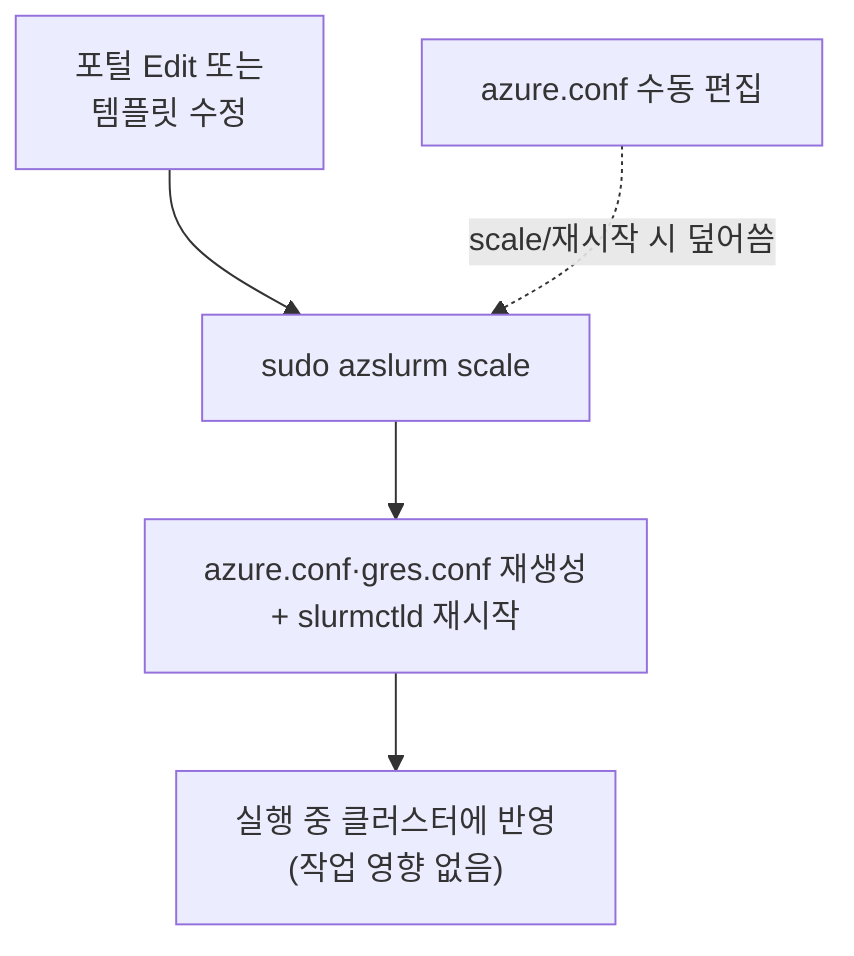

# 4. 노드 증설/감설 및 노드 사이즈 변경

이 문서는 요청사항 **"CycleCloud 노드 증/감설, 노드 사이즈 변경"**에 해당하며, 수동/자동 노드 조정 방법과 **KT 환경의 Scale-in 방지 특이사항**을 다룹니다.

---

## 4.1 Scale-in 방지

- Slurm은 필요할 때만 자원을 할당하고, 사용하지 않으면 자동 회수하여 비용 효율적으로 운영할 수 있다.
- 하지만 Reserved Instance 계약이 포함되어 Scale-in이 불필요한 경우에는 자동 축소를 방지해야 한다.
- 기본적으로 Suspend time이 300초라 노드에 Job이 할당되지 않으면 5분내에 Scale in 된다.
- CycleCloud UI의 `keep_alive` 옵션은 정상적으로 작동하지 않는다. (2025년 9월 기준)

파티션별 Scale-in 제외 설정: `/etc/slurm/slurm.conf`

```ini
SuspendExcParts=hpc   # hpc 파티션의 노드를 자동 축소 대상에서 제외
```

적용

```bash
sudo scontrol reconfigure
```

## 4.2 노드 증감설 방식 비교

CycleCloud에서 노드는 **노드 배열(node array)** 단위로 관리됩니다 (예: `scheduler`, `hpc`, `login`).

| 방식 | 동작 및 특징 | 사용 상황 |
|------|--------------|-----------|
| **자동확장 (Autoscale)** | Slurm 큐에 제출된 작업(Job) 수요에 따라 노드 자동 생성 및 유휴 시 자동 축소 | 일반 운영 환경 권장 |
| **수동 (Manual Scale)** | CLI(`azslurm`) 또는 포털에서 운영자가 직접 노드 수를 제어 | 테스트, 사전 워밍업, RI 전용 노드 운영 |

---

## 4.3 자동확장 수량 조정 (Autoscale Limits)

### 포털 GUI에서 조정


1. **Clusters → 해당 클러스터 → Edit** 선택.
2. **Required Settings** 의 **Auto-Scaling** 파라미터 수정:
   - `Max HPC Cores` (또는 코어/인스턴스 수): 상한 값을 늘려 자동 증설 범위 확대.
3. **Save** 클릭.

> ⚠️ **KT 운영 주의사항 (버전별 Count 기준)**  
> - CycleCloud 8.6 이전: Count 값이 **CPU 코어 수** 기준
> - CycleCloud 8.7 이후: Count 값이 **VM 인스턴스 개수** 기준
> - 이미 기동 중인 클러스터에서는 UI 수량 변경만으로는 즉시 적용되지 않을 수 있으므로 스케줄러 `azure.conf` 및 `azslurm` 조정을 병행해야 합니다.

> 🚨 **실측 사례: 실행 중 클러스터에서 UI 수량 확장/파티션 추가가 반영되지 않음**  
> 이미 동작 중인 클러스터에서 UI로 노드 수를 늘리거나(예: `[1-3]` → `[1-4]`) 새 파티션을 추가하면 **`sinfo` 상으로는 정상으로 보이지만 실제 노드 할당은 실패**합니다. 다음과 같은 오류가 로그에 남습니다.
> ```text
> hpc*  up  infinite  2  idle~ cycle-lab-hpc-[1-3]
> Error 'Unknown node name(s): cycle-lab-hpc-4': See the rest in the log file
> ```
> → **확장(증설)은 반드시 스케줄러에서 `sudo azslurm scale`(4.7) 로 `azure.conf`·`gres.conf` 를 재생성**해야 실제 반영됩니다. UI 값도 함께 저장해 두어야 이후 재시작 시 유지됩니다.

### 스케줄러에서 수량 조정 (축소만, 재시작 없이)
**감설(축소)** 은 스케줄러의 `azure.conf` 를 직접 편집해 즉시 반영할 수 있습니다(증설은 위 `azslurm scale` 사용).
```bash
# 1) 스케줄러 노드에 접속 후 azure.conf 편집 (경로의 클러스터명은 환경에 맞게)
cyclecloud connect scheduler -c slurm-first-cluster
sudo vi /sched/slurm-first-cluster/azure.conf
```
편집 대상 파티션의 노드 범위를 원하는 수량으로 줄입니다(예: `[1-3]` → `[1-2]`, 최대 3대 → 2대).
```ini
PartitionName=hpc Nodes=slurm-first-cluster-hpc-[1-2] Default=YES DefMemPerCPU=1536 MaxTime=INFINITE State=UP
Nodename=slurm-first-cluster-hpc-[1-2] Feature=cloud STATE=CLOUD CPUs=2 ThreadsPerCore=1 RealMemory=3072
```
```bash
# 2) 설정 반영
sudo scontrol reconfigure
```
> 📌 이 수동 편집은 이후 `azslurm scale` 또는 클러스터 재시작 시 **템플릿 기준으로 덮어써집니다**(→ 4.6). 영구 반영은 UI/템플릿 값을 함께 수정하세요.

---

## 4.4 수동 노드 할당 및 회수 (`azslurm`)

스케줄러 노드에서 `azslurm` 명령어로 즉시 노드를 프로비저닝(Resume)하거나 회수(Suspend)할 수 있습니다.


### 1) 노드 상태 확인 (`sinfo`)
```bash
sinfo
# PARTITION AVAIL  TIMELIMIT  NODES  STATE NODELIST
# hpc*         up   infinite      2  idle~ cyclecloud-lab-hpc-[1-2]
```

### 2) 노드 수동 할당 (Resume)
```bash
sudo -i
azslurm resume --node-list cyclecloud-lab-hpc-1
```
→ Azure에서 `cyclecloud-lab-hpc-1` VM이 프로비저닝되며 `Acquiring → Ready`로 전환됩니다.

### 3) 노드 수동 회수 (Suspend)
```bash
azslurm suspend --node-list cyclecloud-lab-hpc-1
```
→ 해당 노드 VM이 혜지 및 완전 삭제(Deallocate/Delete)됩니다.

---

## 4.5 KT 운영 지침: GPU VM Scale-in 방지 (`SuspendExcParts`)

> 🚨 **IMPORTANT: RI(Reserved Instance) 적용 GPU VM Scale-in 방지**  
> Slurm 기본 설정은 300초(5분) 동안 유휴(Idle) 시 노드를 자동 감설(Scale-in)합니다.  
> 하지만 KT 환경의 GPU VM은 **Reserved Instance(RI)** 계약이 체결되어 있어 자동 감설 시 비용 절감 효과 없이 재할당 실패(Capacity 부족) 위험만 높아집니다.  
> 포털의 `keep_alive` 옵션이 오작동하는 사례가 있으므로, 아래와 같이 Slurm 설정으로 직접 제외해야 합니다.

### 설정 방법 (`/etc/slurm/slurm.conf`)
```ini
# /etc/slurm/slurm.conf
# hpc 파티션 노드들을 자동 축소(Suspend) 대상에서 제외
SuspendExcParts=hpc
```

### 설정 반영
```bash
sudo scontrol reconfigure
```

---

## 4.6 노드 사이즈 (VM SKU) 변경 절차

CycleCloud는 동작 중인 VM의 크기를 실시간 변경하지 않으며, **노드 배열의 SKU 설정 변경 → 기존 노드 Terminate → 새 크기로 재생성** 방식을 사용합니다.

1. **Clusters → 클러스터 선택 → Edit**.
2. 변경 대상 배열의 **Machine Type / VM Size** 수정 (예: `Standard_D4s_v5` → `Standard_D8s_v5` 또는 `Standard_HB176rs_v4`).
3. **Save** 클릭.
4. **Arrays 탭**에서 기존 노드를 선택하여 **Terminate**:
   - 이후 새 작업이 제출되거나 `azslurm resume` 시 **변경된 SKU 크기**로 VM이 생성됩니다.

> 📌 **VM SKU 변경 ≠ OS 디스크 사이즈 변경**입니다. 부팅(OS) 디스크 용량을 바꾸려면 **4.10** 절차를 따르세요.

## 4.7 변경사항을 실행 중인 클러스터에 적용 (`azslurm scale`)



포털 Edit 또는 템플릿 변경 후, 스케줄러 노드에서 `azslurm scale` 을 실행하면 **클러스터 재시작 없이** 변경이 반영됩니다. `azure.conf`·`gres.conf` 를 다시 생성하고 `slurmctld` 를 재시작하며, 실행 중인 작업에는 영향을 주지 않습니다.
```bash
cyclecloud connect scheduler -c slurm-train
sudo -i
azslurm scale
```
> 📌 스케줄러에서 `azure.conf` 를 **수동 편집**한 내용이 사라지는 이유가 이것입니다. `azslurm scale` 은 클러스터 **템플릿**을 기준으로 `azure.conf` 를 재생성하므로, 영구 반영은 템플릿을 수정해야 합니다.
```bash
# 영구 반영: 파라미터 내보내기 → 템플릿(slurm.txt) 수정 → 강제 재적용 → scale
cyclecloud export_parameters slurm-train > slurm-train.json
cyclecloud import_cluster slurm-train -c slurm -f slurm.txt -p slurm-train.json --force
sudo azslurm scale
```

## 4.8 `azslurm` 주요 명령 및 KeepAlive 주의

스케줄러 노드에서 `root` 로 실행하는 자동확장 CLI 입니다(자동완성 지원).

| 명령 | 용도 |
|------|------|
| `azslurm scale` | 템플릿 기준 `azure.conf` 재생성 + `slurmctld` 재시작 |
| `azslurm resume/suspend --node-list` | 노드 즉시 기동/회수 |
| `azslurm partitions` | 파티션 정의 출력(`azure.conf` 반영 결과) |
| `azslurm limits` | 패밀리/리전 쿼터 기준 가용 노드 수 |
| `azslurm keep_alive` | 특정 노드를 축소 대상에서 제외/해제 |
| `azslurm retry_failed_nodes` | 실패 상태 노드 재시도 |
| `azslurm remove_nodes` | 인스턴스는 두고 스케줄러에서만 노드 제거 |

> ⚠️ **KeepAlive/좀비 노드**: 포털에서 `KeepAlive=true` 로 두어도 Slurm 내부 상태는 `powered_down` 이 되어 **좀비 노드**(`down~`/`drained~`)가 될 수 있습니다. 축소 방지는 **4.5 `SuspendExcParts`** 또는 **`azslurm keep_alive`** CLI 를 사용하세요. 좀비 노드는 해당 노드에서 `systemctl restart slurmd` 로 복귀하거나 `azslurm suspend` 로 정리합니다.

## 4.9 노드 재부팅 SOP (용량/RI 안전 절차)

노드 재부팅 시 가장 중요한 원칙: **"재부팅"과 "재할당(deallocate→start)"을 구분**합니다. 용량 부족 위험은 VM을 **deallocate(할당 해제)** 했다가 다시 켤 때 발생하며, **할당을 유지한 채 OS만 재부팅**하면 발생하지 않습니다.

> 참고: **Quota ≠ Capacity**. Quota(구독 vCPU 상한)는 지원 요청으로 증설 가능하지만, Capacity(리전 물리 GPU 재고)가 없으면 quota가 남아도 재할당이 실패합니다. **RI(Reserved Instance)는 요금 할인일 뿐 물리 용량을 보장하지 않습니다** — 용량 보장은 별도의 **On-demand Capacity Reservation** 이 필요합니다.

### 올바른 재부팅 방법 (할당 유지)
| 방법 | 동작 | 용량 위험 |
|------|------|-----------|
| `az vm restart -g <rg> -n <vm>` | 할당 유지 재부팅 | **없음** ✅ |
| 포털 → VM → **Restart** | 할당 유지 재부팅 | **없음** ✅ |
| 노드 내부 `sudo reboot` (SSH/Run Command) | OS 재부팅 | **없음** ✅ |
| 포털 **Stop(Deallocate)** → Start | 할당 해제 후 재획득 | **높음** ❌ |
| CycleCloud **Terminate** / `azslurm suspend` | 노드 삭제 후 재생성 | **높음** ❌ |

### Slurm 노드 in-place 재부팅 절차
```bash
# 1) 새 Job 배치 중단 (기존 Job은 마저 실행)
scontrol update nodename=<node> state=drain reason="planned reboot"
# 2) drain 완료(작업 종료) 대기 후, 할당 유지한 채 OS 재부팅
az vm restart -g <rg> -n <node>      # 또는 노드에서 sudo reboot
# 3) 복귀
scontrol update nodename=<node> state=resume
```

### deallocate가 불가피한 경우 (예: 사이즈 변경 4.6)
1. **사전 quota 확인**: `az vm list-usage -l <region>` 로 대상 VM 계열 여유 확인, 부족 시 증설 요청.
2. **On-demand Capacity Reservation** 으로 해당 SKU 용량을 미리 확보(deallocate 중에도 용량 홀드).
3. 확보가 어려우면 **Azure Capa 팀과 일정 조율** 후 진행 (KT 지침과 동일 → [1장](01-환경-개요.md)).

---

## 4.10 OS(부팅) 디스크 사이즈 변경 (`BootDiskSize` / VMSS)

CycleCloud 계산 노드는 **VMSS(가상 머신 확장 집합)** 로 생성되므로, OS 디스크 용량 변경은 **① 클러스터 전체 반영**과 **② 특정 파티션만 반영** 두 방식이 있습니다. (VM SKU 변경 4.6과는 별개입니다.)

> 🚨 **가장 흔한 실수(반드시 재시작)**: 운영 중 클러스터에서 UI로 `BootDiskSize` 만 바꾸고 **재시작하지 않으면** 문제가 발생합니다.
> - 기존 HPC 노드는 정상이나, **같은 VMSS로 새로 뜨는 노드는 디스크 용량이 불일치**하여 오류가 납니다.
> - **스케줄러 노드는 VM 기반**이라, 디스크 사이즈 변경 후 재시작하면 오류가 발생합니다.
>
> → 변경 후에는 반드시 **클러스터 Terminate → Start** 로 전체를 재생성하세요.

### 방식 ① 클러스터 전체 반영 (권장, 노드 전체 재시작)
1. **Clusters → 클러스터 선택 → Edit → Advanced Settings**.
2. **BootDiskSize** 값을 `0` 에서 원하는 크기로 변경.
   - ⚠️ **Default `0` 은 실제로 64GB로 생성**됩니다. 예: `128` 입력 시 128GB.
3. **Save** 후 클러스터를 **Terminate → Start** (노드 전체 재생성으로 새 디스크 크기 반영).


### 방식 ② 특정 파티션만 변경 (클러스터 전체 재시작 없이)
특정 파티션(예: GPU 노드)의 OS 디스크만 바꿔야 할 때, 해당 VMSS 를 직접 수정하고 **새로 뜨는 노드에만** 반영합니다.

1. 해당 파티션의 **VMSS 이름 확인** (클러스터 노드 리소스 그룹에서 조회).
2. VMSS OS 디스크 사이즈 변경:
   ```bash
   az vmss update \
     -g <resource-group> \
     -n <VMSS-name> \
     --set "virtualMachineProfile.storageProfile.osDisk.diskSizeGb=256"
   ```
3. 출력에서 `diskSizeGb` 가 변경되었는지 확인:
   ```json
   "osDisk": { "caching": "None", "createOption": "FromImage", "diskSizeGb": 256 }
   ```
4. **변경 후 새로 생성되는 노드부터** 새 디스크 크기로 적용됩니다(기존 실행 노드는 영향 없음).

> 💡 이 방식은 이미 실행 중인 노드는 그대로 두고 **자동확장으로 새로 뜨는 노드**에만 큰 디스크가 필요한 경우(예: GPU 워크로드 데이터 캐시)에 유용합니다.

---

다음 단계: [5. Storage Account / Disk 마운트](05-스토리지-디스크-마운트.md)
