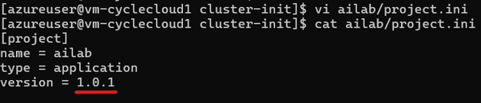
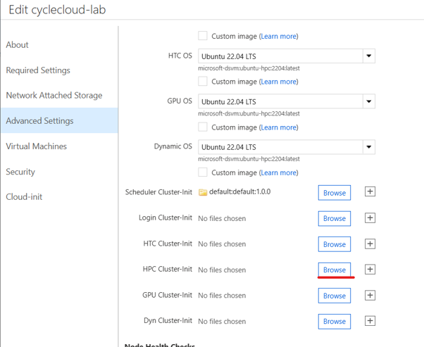

# 6. cluster-init 및 커스텀 스크립트

이 문서는 노드 부팅 스크립트 방식인 **cloud-init**과 **cluster-init** 비교, KT 운영 환경의 cluster-init 프로젝트 작성·업로드·적용 절차를 다룹니다.

---

## 6.1 cloud-init vs cluster-init 비교

| 항목 | cloud-init | cluster-init (권장) |
|------|------------|---------------------|
| **제공 주체** | Azure / VMSS Native | CycleCloud 전용 수렴(converge) 서비스 |
| **실행 시점** | VM 최초 부팅 시 1회 | CycleCloud가 노드를 구성/수렴할 때마다 |
| **수정 시 영향** | **전체 클러스터 재기동 필요** (`CloudInit mismatch` 오류 발생) | **개별 노드/배열 단위 실시간 라이브 적용 가능** |
| **재실행** | 불가 | `jetpack converge` 명령으로 노드에서 즉시 재실행 가능 |
| **버전 관리** | 불가 | `project.ini` 파일 기반 프로젝트 버전 단위 관리 |

> 🚨 **KT 운영 규칙: cloud-init 수정 금지**  
> 운영 중인 클러스터에서 `cloud-init`을 수정하면 새 노드가 기존 VMSS 속성과 불일치하여 프로비저닝이 실패합니다. KT 환경에서는 노드 구성 스크립트 작성 시 **반드시 cluster-init 프로젝트 방식**을 사용합니다.  
> `This node does not match existing scaleset attribute: CloudInit`

KT 환경에는 Scale-in 방지, NVIDIA 드라이버 버전 업, 마운트 등 4~5개 스크립트가 적용되어 있습니다.

---

## 6.2 cluster-init 프로젝트 생성 및 구조

### 1) 프로젝트 초기화
CycleCloud Server VM(`cc-server`)에서 실행합니다.
```bash
mkdir -p ~/cluster-init && cd ~/cluster-init
cyclecloud project init myproject
```


### 2) 프로젝트 디렉터리 구조
```
myproject/
├── project.ini           # 프로젝트 이름 및 버전 관리 파일
└── specs/
    └── default/
        └── cluster-init/
            ├── scripts/  # 실행할 셸 스크립트 (파일명 순서대로 자동 실행)
            ├── files/    # 노드로 복사할 설정 파일 및 바이너리
            └── tests/    # 테스트 스크립트
```

---

## 6.3 버전 관리 및 스크립트 작성

### 1) `project.ini` 버전 관리
스크립트 수정 시 `project.ini` 버전을 올려 배포합니다.
```ini
[project]
name = myproject
type = application
version = 1.0.1   # 기존 1.0.0 에서 버전 상향
```


### 2) 스크립트 작성 (`specs/default/cluster-init/scripts/`)
파일명 순서대로 실행되므로 `01-`, `02-` 형태의 접두사를 권장합니다.

```bash
# specs/default/cluster-init/scripts/01-install-packages.sh
#!/bin/bash
set -e
echo "Executing custom cluster-init script..."
yum install -y htop tmux jq
```


---

## 6.4 Locker 업로드 및 클러스터 적용

### 1) Locker 로 프로젝트 업로드
Locker 이름을 확인한 뒤 프로젝트를 업로드합니다.
```bash
cyclecloud locker list
# 예: cyclecloud-lab-storage

cd ~/cluster-init/myproject
cyclecloud project upload cyclecloud-lab-storage
```


### 2) 웹 포털에서 클러스터에 프로젝트 적용


1. **Clusters → Slurm 선택 → Edit → Advanced Settings**.
2. 적용 대상 노드 배열(hpc/execute 등)의 **Cluster-Init** 탭으로 이동.
3. **Browse** 버튼 클릭 → 생성한 `myproject` 선택 → 업로드한 버전(`1.0.1`) 선택 → **Select**.
4. **Save** 클릭.

---

다음 단계: [7. Slurm Job Accounting 설정](07-Job-Accounting-설정.md)
