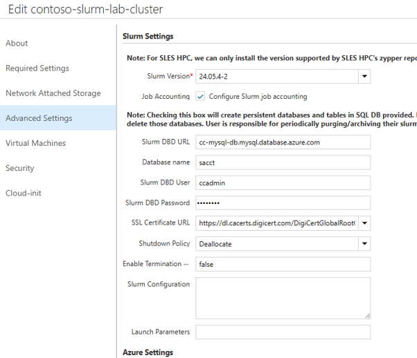
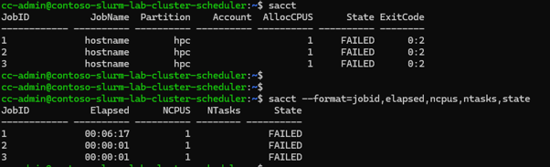

# 7. Slurm Job Accounting 설정

이 문서는 Slurm 클러스터의 작업 실행 이력, 자원 사용량(CPU/GPU/메모리)을 영구 보존하여 정산 및 가용성 분석에 활용하는 **Job Accounting (`sacct`) 구축 방법**과 **Azure Database for MySQL - Flexible Server 연동 절차**를 설명합니다.

---

## 7.1 Job Accounting 의 필요성

- **이력 소실 방지**: Slurm 기본 설정은 작업 이력을 메모리에만 보관하므로 스케줄러 재시작 시 데이터가 사라집니다.
- **비용 정산 (Chargeback)**: 사용자, 팀, 프로젝트별 CPU/GPU 사용 시간을 정밀하게 집계할 수 있습니다.
- **용량 계획**: `sacct`, `sreport` 명령어로 자원 효율성(대기 시간 vs 실행 시간)을 분석할 수 있습니다.

---

## 7.2 Azure Database for MySQL Flexible Server 사전 준비

| 항목 | 설정 권장값 |
|------|-------------|
| **VNet** | CycleCloud Server 및 클러스터와 동일한 VNet (`cc-vnet`) |
| **Subnet** | 별도의 Private Subnet 생성 및 위임 |
| **Networking** | **Private Access (VNet Integration)** 선택 (공인 IP 차단) |

---

## 7.3 웹 포털 GUI에서 Job Accounting 활성화

Cyclecloud UI에서 Job Accounting을 활성화하는 방법이며, 이미 생성된 클러스터의 경우 클러스터 재시작이 필요하다. 클러스터 재시작이 어려운 경우 아래 방법 B를 활용하되, 재시작을 고려하여 UI에도 적용해둔다.

Cyclecloud UI > Cluster > (이미 생성된 경우) Edit > Advanced Settings > Slurm Settings > Job Accounting 선택> 정보 입력



1. **Clusters → 해당 클러스터 → Edit → Advanced Settings**.
2. **Slurm Settings** 의 **Job Accounting** 옵션 체크:
   - **Database Host**: MySQL 서버 FQDN (예: `cc-mysql-db.mysql.database.azure.com`)
   - **Database Admin User**: DB 관리자 계정명
   - **Database Password**: DB 비밀번호
3. **Save** 클릭.



---

## 7.4 운영 중인 클러스터 수동 연동 (`slurmdbd`)

이미 기동 중인 클러스터에서 재시작 없이 `slurmdbd`를 수동 설정하는 방법입니다.

### 1) SSL CA 인증서 다운로드
스케줄러 노드에서 DigiCert 글로벌 루트 인증서를 다운로드합니다.
```bash
sudo wget https://cacerts.digicert.com/DigiCertGlobalRootG2.crt.pem -O /etc/slurm/AzureCA.pem
```

### 2) DB 접속 설정 (`/etc/slurm/slurmdbd.conf`)
```ini
# /etc/slurm/slurmdbd.conf
AuthType=auth/munge
DbdAddr=localhost
DbdHost=<cluster-name>-scheduler
SlurmUser=slurm
DebugLevel=verbose
LogFile=/var/log/slurmctld/slurmdbd.log
PidFile=/var/run/slurmdbd.pid

# Database info
StorageType=accounting_storage/mysql
StorageHost=cc-mysql-db.mysql.database.azure.com
StorageLoc=sacct
StoragePass=<DB_PASSWORD>
StorageUser=<DB_USER>
StorageParameters=SSL_CA=/etc/slurm/AzureCA.pem
```

### 3) 권한 설정 및 데모 기동
```bash
sudo chown slurm:slurm /etc/slurm/slurmdbd.conf
sudo chmod 600 /etc/slurm/slurmdbd.conf

sudo systemctl start slurmdbd
sudo systemctl restart slurmctld
```

---

## 7.5 동작 검증 (`sacct`)


```bash
# 완료된 작업 이력 조회
sacct

# 특정 기간/사용자별 이력 상세 조회
sacct -X --format=JobID,JobName,User,State,ExitCode,Elapsed,AllocCPUs,AllocTRES
```

## 7.6 운영 시 참고 사항

- **기본 DB 이름**: UI에서 Database Name 을 지정하지 않으면 `<클러스터명>-acct-db` 가 사용됩니다. 클러스터마다 별도 DB 를 두면 Slurm 버전이 다른 클러스터 간 롤업 충돌을 피할 수 있습니다.
- **SSL 인증서**: Azure Database for MySQL Flexible Server 용으로 DigiCert Global Root CA/G2 및 Microsoft RSA Root 2017 이 **결합 CA 번들**로 기본 구성됩니다. 사설 인증서가 필요할 때만 UI의 **Custom SSL Certificate** 토글로 PEM 을 입력합니다.
- ⚠️ **DB는 클러스터 삭제와 함께 지워지지 않습니다.** 클러스터를 삭제해도 MySQL DB 는 남으므로, 이력 아카이브/삭제와 MySQL 비용 관리는 운영자 책임입니다.

## 7.7 작업 비용 리포트 (`azslurm cost`, 실험적)

CycleCloud 8.4+ 및 Job Accounting 활성화 상태에서 `azslurm cost` 로 작업/파티션별 비용을 산출할 수 있습니다(소매 가격 기준이라 실제 청구서와 다를 수 있음).
```bash
azslurm cost -s 2025-03-01 -e 2025-03-31 -o march-2025
# march-2025/jobs.csv, partition.csv, partition_hourly.csv 생성
```

---

다음 단계: [8. 사용자 관리](08-사용자-관리.md)
