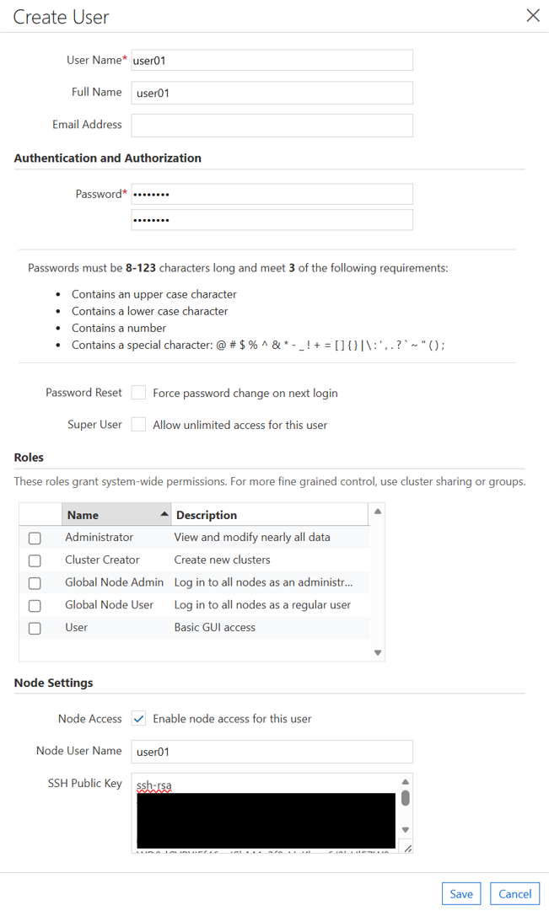

# 8. 사용자 관리 (User Management)

이 문서는 CycleCloud에서 제공하는 사용자 관리 방식 중 **KT 운영 환경에서 사용 중인 Built-in 사용자 관리 방식**, SSH 공개키 등록 및 노드 OS 계정 자동동기화 절차를 다룹니다.

---

## 8.1 CycleCloud 사용자 관리 방식 개요

CycleCloud는 아래 4가지 사용자 인증/관리 방식을 지원합니다:
1. **Built-in** (KT 사용 방식: CycleCloud 내부 DB로 계정 및 SSH Key 관리)
2. **Active Directory**
3. **LDAP**
4. **Microsoft Entra ID (Azure AD)**

---

## 8.2 Built-in 사용자 생성 및 Keypair 등록

### 1) Settings → Users 메뉴 이동


1. 포털 상단 **Settings → Users** 클릭.
2. 좌측 하단 **`+` (Create)** 클릭.

### 2) 계정 정보 및 SSH Keypair 입력




- **Username**: 노드 OS에 생성될 Linux 계정명 (예: `user01`)
- **Roles**: 포털 GUI 접속 권한 설정. (노드 SSH 전용 사용자는 역할을 선택하지 않아도 됨)
- **Node Settings → Public Key**: 사용자의 SSH 공개키(`id_rsa.pub`) 내용 입력.

---

## 8.3 클러스터에 사용자 추가 및 OS 계정 자동 생성


1. **Clusters → 대상 클러스터 선택 → Users 탭** 이동.
2. **Add Users** 선택 → 추가할 사용자(`user01`) 선택 → **Save**.
3. **자동 수렴 (jetpack)**:
   - CycleCloud의 `jetpack` 데몬이 기동 중인 스케줄러 및 계산 노드 OS에 즉시 계정을 생성하고 public key를 `/home/<username>/.ssh/authorized_keys`에 배치합니다.

---

## 8.4 노드 SSH 접속 테스트

등록한 SSH 개인키(`pem`/`rsa`)를 사용하여 노드에 접속합니다.


```bash
# 사용자 계정으로 스케줄러 노드 SSH 접속
ssh -i ~/.ssh/id_rsa user01@20.196.213.145

# 사용자 계정 정보 확인
whoami
# OUTPUT: user01
```

---

## 8.5 Sudo 권한 부여 (선택)

특정 사용자에게 `sudo` 권한을 부여하려면 cluster-init 스크립트 또는 노드 `/etc/sudoers.d/` 에 설정을 추가합니다.

```bash
# /etc/sudoers.d/user01
user01 ALL=(ALL) NOPASSWD: ALL
```

---

다음 단계: [9. 파티션 관리 및 추가](09-파티션-관리-및-추가.md)
