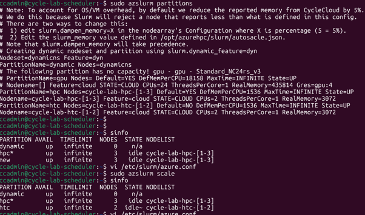

# 9. 파티션 관리 및 신규 파티션 추가

이 문서는 기존 Slurm 계산 노드를 공유하거나 신규 파티션을 추가하는 방법과 **자동 초기화(Reset) 주의사항**을 다룹니다.

---

## 9.1 파티션 설정 수정 (`azure.conf`)

스케줄러 노드의 Slurm 설정 파일(`/etc/slurm/azure.conf`)에서 새 파티션을 정의합니다.

```bash
sudo vi /etc/slurm/azure.conf
```

### 적용 예시: 기존 `hpc` 노드를 공유하는 `new` 파티션 추가
```ini
# /etc/slurm/azure.conf

# 기존 hpc 파티션
PartitionName=hpc Nodes=cycle-lab-hpc-[1-3] Default=YES DefMemPerCPU=1536 MaxTime=INFINITE State=UP
Nodename=cycle-lab-hpc-[1-3] Feature=cloud STATE=CLOUD CPUs=2 ThreadsPerCore=1 RealMemory=3072

# 추가한 new 파티션 (hpc 노드를 공유)
PartitionName=new Nodes=cycle-lab-hpc-[1-3] Default=NO DefMemPerCPU=1536 MaxTime=INFINITE State=UP
```


```bash
# 변경된 설정 즉시 반영
sudo scontrol reconfigure
```

---

## 9.2 노드 회수 및 동적 기동 동작 확인

노드 1대를 `azslurm suspend`로 제거한 뒤 파티션 제출 작업에 따라 정상적으로 `resume` 되는지 확인합니다.


```bash
# 수동 resume 테스트
azslurm resume --node-list cycle-lab-hpc-1
```

---

## 9.3 파티션별 Job 제출 및 물리 자원 제약

파티션 논리는 분리되지만 실제 VM 자원은 공유하므로 물리 Core/Memory 제약을 받습니다.


- **예시**: 2 코어 VM 3대 (총 6개 코어) 환경
- `--cpus-per-task=1` 옵션으로 7개의 Job을 동시 제출하면 **6개는 `RUNNING`**, **1개는 `PENDING(Resources)`** 상태로 큐에서 대기합니다.

---

## 9.4 ⚠️ 수동 추가 파티션의 자동 초기화 주의사항



> 🚨 **CAUTION: GUI Template 동기화로 인한 설정 초기화**  
> `/etc/slurm/azure.conf`를 수동 편집해 추가한 파티션은 아래 조건에서 CycleCloud GUI 설정 템플릿으로 원복되어 삭제됩니다.
>
> 1. 클러스터를 **Terminate 후 Start** 하는 경우
> 2. `azslurm partition` 또는 `azslurm scale` 명령이 수동/자동 실행되는 경우
>
> 영구 파티션은 CycleCloud **클러스터 템플릿(.txt)의 `[[nodearray]]` 및 `[[partition]]` 블록**에 정의합니다.

## 9.5 영구 파티션 추가 (템플릿 기반, 권장)

9.1의 `azure.conf` 수동 편집은 `azslurm scale`/재시작 시 사라집니다(9.4 참고). 영구적으로 파티션을 추가하려면 **클러스터 템플릿**에 `[[nodearray]]` 를 정의하고 재적용합니다.
```bash
cyclecloud export_parameters <클러스터명> > params.json
# slurm.txt 에 [[nodearray specialgpu]] 등 추가 후 강제 재적용
cyclecloud import_cluster <클러스터명> -c slurm -f slurm.txt -p params.json --force
sudo azslurm scale     # 재시작 없이 반영
```
- **파티션 이름 커스터마이즈**: nodearray 이름과 파티션 이름을 다르게 하려면 nodearray 의 `[[[configuration]]]` 에 `slurm.partition = my-name` 을 지정합니다.
- **동적(Dynamic) 파티션**: `slurm.autoscale = true` + `slurm.dynamic_config` 로 한 파티션에서 **여러 VM 크기**를 Feature 로 구분해 사용할 수 있습니다.

---

다음 단계: [10. GPU 모니터링 구축](10-GPU-모니터링-구축.md)
