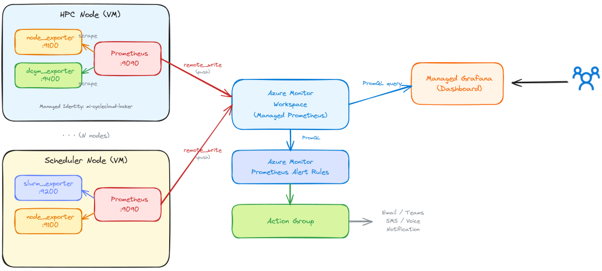
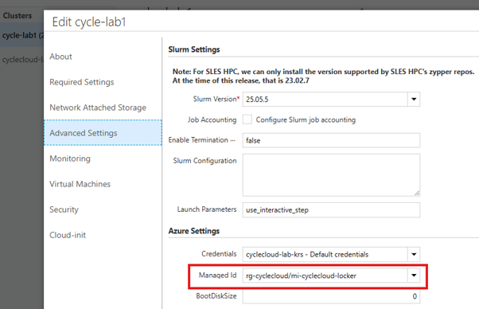
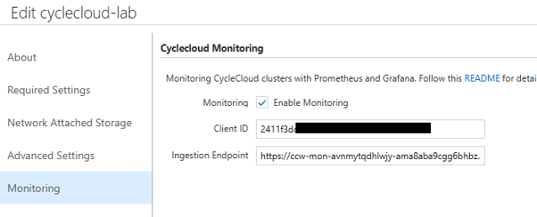

# 10. GPU 모니터링 구축 (Azure Managed Prometheus + Grafana)

이 문서는 **Azure CycleCloud 8.8.1+** 버전 환경에서 Azure Managed Prometheus 및 Managed Grafana를 활용하여 GPU/CPU 자원 사용률을 실시간 모니터링하는 통합 환경 구성 절차를 다룹니다.

---

## 10.1 모니터링 아키텍처



1. **Node Exporters**: 계산 노드의 CPU/메모리/디스크(Node Exporter) 및 NVIDIA GPU(NVIDIA GPU Exporter / DCGM Exporter) 지표 수집
2. **Prometheus Remote Write**: 각 노드의 로컬 Prometheus가 지표를 **Azure Managed Prometheus Workspace** 엔드포인트로 전송
3. **Managed Grafana**: Azure Managed Grafana 대시보드에서 GPU 사용률, 메모리 점유율, 온도, 전력 소비량을 대시보드로 시각화 및 알림 설정

---

## 10.2 Azure Prometheus / Grafana 리소스 생성

### 1) 모니터링 리포지토리 클론 및 배포
```bash
git clone https://github.com/Azure/cyclecloud-monitoring.git
cd cyclecloud-monitoring
./infra/deploy.sh rg-cyclecloud-monitoring
```

### 2) Managed Identity 권한 부여 및 Client ID 확인
CycleCloud Locker용 Managed Identity에 Prometheus Publisher 권한을 추가합니다.



```bash
# Publisher 권한 부여
./infra/add_publisher.sh <umi_resource_group> <umi_name>

# Managed Identity Client ID 추출
az identity show \
  --name <umi_name> \
  --resource-group <umi_resource_group> \
  --query 'clientId' --output tsv
```


### 3) Prometheus Ingestion Endpoint 추출
```bash
jq -r '.properties.outputs.ingestionEndpoint.value' outputs.json
```


---

## 10.3 CycleCloud 포털에서 모니터링 활성화



1. **Clusters → 해당 클러스터 → Edit → Monitoring** 이동.
2. **Client ID**: 위에서 확인한 Managed Identity Client ID 입력.
3. **Prometheus Ingestion Endpoint**: 확인한 Metrics ingestion endpoint URL 입력.
4. **Save** 클릭 후 클러스터 재시작.

---

## 10.4 Exporter 동작 확인 및 내장 모니터링

CycleCloud 4.0.3+ 는 클러스터 생성 **Monitoring 탭**에서 활성화하면 Node Exporter, NVIDIA **DCGM** Exporter(GPU 노드), AzSlurm Exporter(스케줄러)를 자동 설치합니다. 노드에 접속해 `curl` 로 지표 노출을 확인합니다.

| Exporter | 포트 | 대상 노드 | 확인 |
|----------|------|-----------|------|
| Node Exporter | `9100` | 전체 노드 | `curl -s http://localhost:9100/metrics` |
| DCGM Exporter (GPU) | `9400` | NVIDIA GPU VM | `curl -s http://localhost:9400/metrics` |
| AzSlurm Exporter | `9101` | 스케줄러 노드 | `curl -s http://localhost:9101/metrics` |

> AzSlurm Exporter 전용 Grafana 대시보드는 아래로 추가할 수 있습니다.
```bash
git clone https://github.com/Azure/cyclecloud-slurm.git
cd cyclecloud-slurm/azure-slurm-exporter
./add_dashboards.sh <grafana_resource_group> <grafana_name>
```

---

## 10.5 KT Mexico Region 모니터링 주의사항

> 💡 **Mexico Region 구성 관련 안내**  
> 특정 Azure 리전(예: Mexico Region, Korea South 등)에서는 **Azure Managed Grafana가 지원되지 않거나 수집 서비스 리전 제약**이 존재할 수 있습니다.  
> - **해결책 1**: 동일 지리 범위의 가까운 리전(예: US South Central / East US)에 Managed Grafana를 배포하고 데이터 소스로 연동
> - **해결책 2**: CycleCloud Server VM 내에 Self-hosted Grafana를 직접 설치하여 운영

---

> 📎 CycleCloud **전반**(스케줄러 포함) Prometheus 파이프라인·Exporter 포트·Self-hosted 옵션은 [부록. CycleCloud Prometheus 모니터링 구축](부록-Prometheus-모니터링.md)을 참고하세요.

다음 단계: [11. 트러블슈팅 및 로그 확인](11-트러블슈팅-로그.md)
