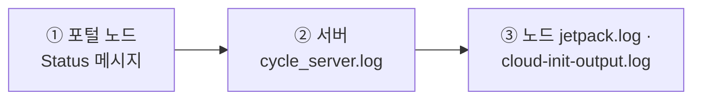

# 11. 기본 트러블슈팅 및 로그 확인

이 문서는 요청사항 **"기본적인 트러블슈팅 방법 (로그 확인 방법)"**에 해당하며, CycleCloud 서버 및 노드의 로그 위치, SSH 없이 진단하는 방법, 그리고 자주 발생하는 문제와 대응 Triage 표를 설명합니다.

---

## 11.1 서버 로그 확인 3가지 접근 방법

CycleCloud 서버 VM(`cc-server`)의 로그를 점검하는 방법은 크게 3가지입니다.

### (A) Azure Portal / az CLI "명령 실행" (SSH 키 불필요) ✅ 권장
Azure RBAC 권한만 있으면 담당자 PC에 SSH 키가 없어도 진단이 가능합니다.
- **포털**: VM `cc-server` → **운영 → 명령 실행 (Run Command) → RunShellScript**
- **Azure CLI**:
  ```bash
  az vm run-command invoke -g rg-cyclecloud-training -n cc-server \
    --command-id RunShellScript \
    --scripts "systemctl is-active cycle_server; tail -n 50 /opt/cycle_server/logs/cycle_server.log" \
    --query "value[0].message" -o tsv
  ```

### (B) SSH 접속
```bash
ssh -i keys/cyclecloud_rsa azureadmin@20.196.213.145
```
*(NSG `cc-nsg`에 허용된 IP 주소에서만 접속 허용)*

### (C) Azure Serial Console (직렬 콘솔)
포털 → VM `cc-server` → **지원 + 문제 해결 → 직렬 콘솔 (Serial console)**로 접근.

---

## 11.2 CycleCloud 서버 로그 주요 경로 (`/opt/cycle_server/logs/`)

| 로그 파일 | 내용 및 점검 목적 |
|-----------|-------------------|
| **`cycle_server.log`** | **메인 애플리케이션 로그** (가장 먼저 tail/grep 점검) |
| `catalina.out` / `catalina.err` | 웹 포털(Tomcat/Java) 기동 및 서블릿 오류 로그 |
| `installation.log` | CycleCloud 서버 최초 설치/패키지 구성 로그 |
| `imds.log.log` | Azure IMDS 토큰 및 Managed Identity 인증 관련 로그 |

### 필수 점검 명령
```bash
# 서비스 동작 상태 확인
sudo systemctl status cycle_server

# 실시간 로그 모니터링
sudo tail -n 100 -f /opt/cycle_server/logs/cycle_server.log

# 에러 및 예외 키워드 검색
sudo grep -iE "error|exception|denied" /opt/cycle_server/logs/cycle_server.log | tail -50

# 서비스 재시작
sudo systemctl restart cycle_server
```

---

## 11.3 계산 노드 내부 로그 및 CLI 진단

### 1) CLI 클러스터/노드 상태 조회
```bash
cyclecloud show_cluster <cluster-name>
cyclecloud show_nodes -c <cluster-name> --states=Error
```

### 2) 계산 노드 내부 에이전트 로그
노드 생성 실패 또는 스크립트 실행 에러 시 노드로 SSH 접속하여 점검합니다:
```bash
# 노드 직접 접속
cyclecloud connect <node-name> -c <cluster-name>

# jetpack 초기화 및 converge 로그
sudo cat /opt/cycle/jetpack/logs/jetpack.log

# cloud-init 및 시스템 부팅 스크립트 로그
sudo cat /var/log/cloud-init-output.log
```

### 3) 노드가 할당되었으나 오류난 경우 — UI 우회 직접 SSH ✅
노드가 Azure에는 할당(Allocation)되었지만 CycleCloud UI 연동 전에 실패한 경우, `cyclecloud connect` 가 동작하지 않을 수 있습니다. 이때는 **CycleCloud 서버에 내장된 키로 문제 노드에 직접 SSH** 하여 원인을 파악합니다(서버가 점프호스트 역할).
```bash
# CycleCloud 서버(cc-server)에서 실행 — 서버 내장 개인키로 노드 private IP에 직접 접속
sudo ssh -i /opt/cycle_server/.ssh/cyclecloud.pem cyclecloud@<문제-노드-IP>
```
> 💡 문제 노드의 private IP 는 포털 노드 상세 또는 `cyclecloud show_nodes -c <cluster-name>` 의 `PrivateIp` 로 확인합니다. 접속 후 `jetpack.log`, `cloud-init-output.log`, `/var/log/waagent.log`(CSE 다운로드 오류) 를 점검합니다.

---

## 11.4 자주 발생하는 장애 증상 및 Triage 진단표

> **진단 순서(Triage Workflow):**  
> ① 웹 포털 문제 노드의 **Status 메시지** 확인 → ② 서버 `cycle_server.log` 검색 → ③ 노드 내부 `jetpack.log` 확인.



| 증상 | 흔한 원인 | 진단 방법 | 해결 조치 |
|------|-----------|-----------|-----------|
| 노드가 안 생기고 `Acquiring` 상태 지속 | vCPU Quota(쿼터) 부족 | `az vm list-usage -l koreacentral` | 쿼터 증설 신청 또는 더 작은 SKU/다른 배열 지정 |
| 노드 `Error`: "allocation" / "capacity" | 리전/존 VM 가용 용량 부족 | 노드 Status 에러 메시지 | VM 크기 변경, 다른 가용성 존 지정, 일정 시간 후 재시도 |
| 노드 `Error`: "CloudInit mismatch" | `cloud-init` 수동 수정 후 노드 기동 | 노드 Status / `cycle_server.log` | `cycle_server fix_mismatched_attributes <cluster> --extra-attribute CloudInit` 또는 클러스터 재시작 후 `cluster-init` 방식 전환 |
| 클러스터 Start 실패 / "credentials" 에러 | Managed Identity 권한 미부여 | Settings > Subscriptions, `cycle_server.log` | VM 관리 ID에 구독 `Contributor` 역할 다시 부여 |
| 작업 제출해도 노드가 안 늘어남 (Autoscale 안 됨) | Max Cores 도달 또는 파티션 설정 미흡 | `sinfo`, `squeue -l` | Max Cores 상향, `azslurm` 파티션 동기화, `SuspendExcParts` 확인 |
| 작업이 `PENDING` (PD) 상태 유지 | 가용 노드 부족, 자원 요청 과다 | `squeue -l`, `scontrol show job <jobid>` | 자원 요청 수량 조정(`--cpus-per-task`), 쿼터 및 노드 상태 점검 |
| 포털(HTTPS) 접속 불가 | `cycle_server` 다운 또는 NSG 443 차단 | `systemctl status cycle_server` | 서비스 재시작, NSG 443 허용 규칙 확인 |

---

## 11.5 인프라 진단 유용한 Azure CLI 명령어

```bash
# 1) vCPU 쿼터 사용량 확인
az vm list-usage -l koreacentral -o table | grep -iE "vCPU"

# 2) 특정 SKU 리전 가용 여부 확인
az vm list-skus -l koreacentral --size Standard_D -o table

# 3) 서버 VM 관리 ID 권한 확인
PID=$(az vm show -g rg-cyclecloud-training -n cc-server --query identity.principalId -o tsv)
az role assignment list --assignee $PID -o table

# 4) NSG 인바운드 규칙 확인
az network nsg rule list -g rg-cyclecloud-training --nsg-name cc-nsg -o table
```

## 11.6 지원용 로그 일괄 수집 (`capture_logs.sh`)

Microsoft 엔지니어에게 전달할 로그/구성 데이터를 노드에서 한 번에 수집합니다. 스케줄러/로그인/실행 노드 어디서나 실행 가능하며, **점검 대상 노드마다** 실행해 생성된 tarball 을 지원 케이스에 첨부합니다.
```bash
/opt/cycle/capture_logs.sh    # tarball 생성 → 지원 케이스 첨부
```

## 11.7 노드가 DRAIN 되는 경우 (Health Check)

Slurm 의 `HealthCheckProgram` 이 **healthagent** 를 통해 문제를 감지하면 노드를 **DRAIN** 처리합니다(기본 60초 주기).
```bash
sinfo -R                       # DRAIN/DOWN 노드와 사유 확인
azslurm retry_failed_nodes     # 실패 노드 재시도
# 특정 노드 복구: 해당 노드에서 sudo systemctl restart slurmd
```
> healthagent 는 별도 systemd 서비스로 항상 실행되며 CycleCloud UI 에도 상태 오류를 표시합니다.

---

## 11.8 버전 정보 확인 (지원 케이스 필수 정보)

지원 요청 시 CycleCloud/Slurm/Jetpack 버전을 함께 제출하면 원인 파악이 빨라집니다.

### CycleCloud 버전
CycleCloud UI **우측 상단의 `?` 아이콘** 클릭 → 버전 표시.


### Slurm 버전
CycleCloud UI → **클러스터 → Edit → Advanced Settings → Slurm Version** 에서 확인.

### Slurm Jetpack(프로젝트) 버전
스케줄러 노드에서 실행:
```bash
sudo jetpack config cyclecloud.cluster_init_specs --json | egrep 'project"|version'
```
출력 예시:
```json
"project": "slurm",
"version": "3.0.12"
```

> 📌 **버전에 따라 동작이 달라지는 대표 사례**: 노드 수량 Count 기준(8.6 이전=코어 / 8.7+=인스턴스, → [4.2](04-노드-증감설-사이즈변경.md)). 지원 문의 전 이 세 버전을 먼저 확인하세요.

---

다음 단계: [12. 데모 런북 (진행자 체크리스트)](12-데모-런북.md)
