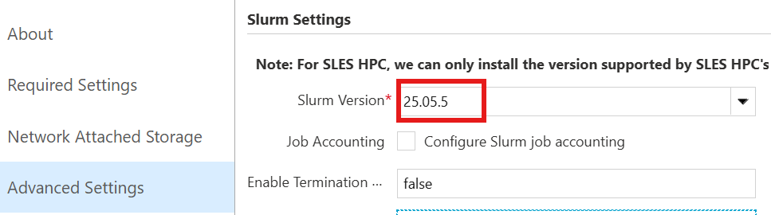

# 13. 버전 정보 확인 (CycleCloud · Slurm)

운영 지원 시 CycleCloud와 Slurm의 버전 정보를 확인하는 방법입니다.

---

## 13.1 CycleCloud 버전 확인

포털 우측 상단의 **`?` (도움말)** 아이콘을 클릭해 확인합니다.


서버 VM에서 CLI로도 확인할 수 있습니다.

```bash
cyclecloud --version
```

---

## 13.2 Slurm 버전 확인

포털에서 클러스터에 지정된 Slurm 버전을 확인합니다.

> **Clusters → 클러스터 → Edit → Advanced Settings → Slurm Version**



스케줄러 노드에 접속해 직접 확인할 수도 있습니다.

```bash
sinfo --version
```

---

## 13.3 Slurm Jetpack(프로젝트) 버전 확인

노드에 적용된 cluster-init 프로젝트(spec) 버전은 스케줄러 노드에서 확인합니다.

```bash
sudo jetpack config cyclecloud.cluster_init_specs --json | egrep 'project"|version'
```

출력 예시는 다음과 같습니다.

```json
"project": "slurm",
"version": "3.0.12"
"project": "slurm",
"version": "3.0.12"
```
