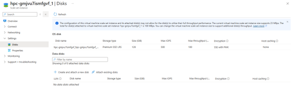
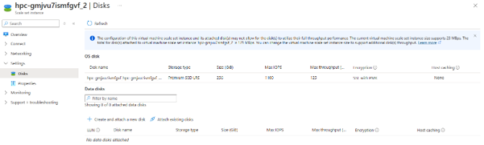

# 15. 디스크 사이즈 변경 (OS/부팅 디스크)

CycleCloud 노드는 VMSS로 생성되므로, OS 디스크 크기를 변경하면 클러스터 재시작 또는 특정 노드 그룹 재할당이 필요합니다.

OS 디스크 크기 변경은 VM SKU 변경([4.4](04-노드-증감설-사이즈변경.md#44-노드-사이즈vm-sku-변경))과 별개입니다.

---

## 15.1 클러스터 전체 반영

노드 전체 재시작이 필요한 방식이며, 가장 안전합니다.

### 1) CycleCloud UI에서 BootDiskSize 변경

> **Clusters → 클러스터 → Edit → Advanced Settings → BootDiskSize**

기본값 `0` 은 실제로는 **64GB** 로 생성됩니다. 원하는 크기로 변경합니다. (예: `128` → 128GB, `1000` → 1TB)


### 2) 클러스터 Terminate 후 Start

변경을 저장한 뒤 클러스터를 **Terminate → Start** 하여 전체 노드를 재생성합니다.


> ⚠️ **재시작하지 않으면 오류가 발생합니다.**
>
> UI로 `BootDiskSize` 만 변경하고 재시작하지 않으면 다음 문제가 발생합니다.
>
> - 기존 HPC 노드는 정상이지만, **새로 뜨는 HPC 노드**는 동일 VMSS를 사용하면서 디스크 용량이 불일치하여 오류가 발생합니다.
>
>   
>
> - **스케줄러 노드**는 VM 기반이라 OS 디스크 크기 변경 후 재시작 시 오류가 발생합니다.
>
>   

---

## 15.2 특정 파티션만 변경

특정 파티션의 OS 디스크만 변경해야 할 경우, 클러스터 전체 재시작 없이 해당 VMSS를 직접 수정합니다. **새로 뜨는 노드에만** 반영됩니다.

### 1) VMSS 찾기

해당 파티션의 노드 리소스 그룹에서 VMSS 이름을 확인합니다.

### 2) VMSS OS 디스크 사이즈 변경

```bash
az vmss update \
  -g <resource-group> \
  -n <VMSS-name> \
  --set "virtualMachineProfile.storageProfile.osDisk.diskSizeGb=256"
```

출력에서 `diskSizeGb` 값이 변경되었는지 확인합니다.

```json
"osDisk": {
  "caching": "None",
  "createOption": "FromImage",
  "diskSizeGb": 256
}
```

### 3) 노드 재할당 시 자동 반영

변경 후 새로 생성되는 노드부터 적용됩니다. 기존 실행 노드는 영향을 받지 않습니다.





> 실행 중 노드는 유지하면서, 자동확장으로 새로 뜨는 노드에만 큰 디스크가 필요한 경우(예: GPU 데이터 캐시)에 사용합니다.

---

다음 단계: [5. Storage Account / Disk 마운트](05-스토리지-디스크-마운트.md)
