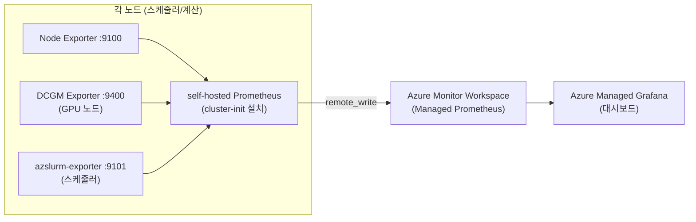

# 부록. CycleCloud Prometheus 모니터링 구축 (전반)

이 문서는 **Azure CycleCloud 클러스터 전반**(스케줄러 + 계산 노드)을 **Prometheus + Grafana** 로 모니터링하는 절차를 정리합니다. GPU 지표는 [10. GPU 모니터링 구축](10-GPU-모니터링-구축.md)을 함께 참고하세요.

> **적용 버전**: CycleCloud **8.8+** / cyclecloud-slurm 프로젝트 **4.0.3+** (내장 Monitoring 탭), **4.0.7+** (azslurm-exporter 포함).  
> 출처: [Azure/cyclecloud-monitoring](https://github.com/Azure/cyclecloud-monitoring), CycleCloud 8.8.0 릴리스 노트(Azure Monitor/Grafana 통합).

---

## A.1 아키텍처 개요



- **Exporter**: 각 노드에서 CPU/메모리/디스크(Node Exporter), NVIDIA GPU(DCGM Exporter), Slurm 스케줄러 지표(azslurm-exporter)를 노출.
- **노드별 self-hosted Prometheus**: `cyclecloud/monitoring` cluster-init 프로젝트가 각 노드·스케줄러에 Prometheus를 설치하고 로컬 Exporter를 수집해 **remote_write** 로 Azure Monitor Workspace에 전송.
- **Azure Monitor Workspace (Managed Prometheus)**: 지표 저장소.
- **Azure Managed Grafana**: 사전 제작 대시보드(`Dashboards/Azure CycleCloud`)로 시각화.

기본 구조는 노드 Prometheus self-hosted, 중앙 저장·시각화 Managed 방식입니다.

---

## A.2 사전 요구사항

| 항목 | 내용 |
|------|------|
| CycleCloud / Slurm | 8.8+ / cyclecloud-slurm 4.0.3+ (Monitoring 탭), azslurm-exporter는 4.0.7+ |
| Managed Identity | **Monitoring Metrics Publisher** 역할을 가진 User-Assigned MI (지표 게시용) |
| 배포 실행 위치 | 로컬 PC 또는 배포 에이전트 — ⚠️ **CycleCloud VM이나 Cloud Shell에서 실행 금지** |
| 네트워크 | 노드가 Azure Monitor Workspace 수집 엔드포인트로 아웃바운드 가능해야 함 |

---

## A.3 1단계: 관리형 모니터링 인프라 배포 (Azure Monitor Workspace + Managed Grafana)

리소스를 만들 수 있는 로컬 머신에서 실행합니다.

```bash
# 1) 모니터링 리소스용 리소스 그룹 생성
az group create -l <location> -n <monitoring_resource_group>

# 2) 리포지토리 클론 및 배포 (Slurm은 --slurm 플래그로 전용 대시보드 포함)
git clone https://github.com/Azure/cyclecloud-monitoring.git
cd cyclecloud-monitoring
./infra/deploy.sh <monitoring_resource_group> --slurm
```
`deploy.sh` 는 Azure Monitor Workspace(Prometheus), Azure Managed Grafana, 사전 제작 대시보드를 생성합니다.

---

## A.4 2단계: Managed Identity에 Publisher 권한 부여

지표 게시에는 MI의 **Monitoring Metrics Publisher** 역할이 필요합니다. `deploy.sh` 는 MI를 만들지 않으므로 기존 Locker MI(또는 CCWS의 `ccwLockerManagedIdentity`)를 사용합니다.

```bash
# Data Collection Rule 등에 Publisher 역할 부여
./infra/add_publisher.sh <umi_resource_group> <umi_name>
```

---

## A.5 3단계: 모니터링 파라미터 확인

클러스터/노드에 설정할 3개 파라미터 값을 구합니다.

```bash
# ① Client ID (Publisher 권한을 가진 MI)
az identity show -n <umi_name> -g <umi_resource_group> --query 'clientId' -o tsv

# ② Ingestion Endpoint (배포 출력에서 추출)
jq -r '.properties.outputs.ingestionEndpoint.value' <infra_monitoring_dir>/outputs.json
```

설정할 3개 파라미터:
```yaml
cyclecloud.monitoring.enabled            = true
cyclecloud.monitoring.identity_client_id = <위 ① Client ID>
cyclecloud.monitoring.ingestion_endpoint = <위 ② Ingestion Endpoint>
```

---

## A.6 4단계: 클러스터에 모니터링 적용

### 방식 A — Slurm 4.0.3+ : 내장 **Monitoring 탭** (권장)
1. **Clusters → 해당 클러스터 → Edit → Monitoring 탭** 이동.
2. **Enable Monitoring** 체크.
3. **Client ID** (`identity_client_id`), **Ingestion Endpoint** (`ingestion_endpoint`) 입력.
4. **Save** 후 클러스터 (재)시작.

내부적으로 `configuration_monitoring_enabled`, `configuration_identity_client_id`, `configuration_ingestion_endpoint` 파라미터에 매핑됩니다.

### 방식 B — 기타 클러스터 유형 : 노드별 Software 설정
Monitoring 탭이 없는 템플릿은 cluster-init 프로젝트를 추가하고 파라미터를 직접 넣습니다.

1. 템플릿의 각 nodearray 설정 뒤에 프로젝트 추가:
   ```ini
   [[[cluster-init cyclecloud/monitoring:default]]]
   ```
2. 포털에서 **스케줄러 노드 및 각 nodearray → Edit → Software/Configuration** 에 A.5의 3개 파라미터를 붙여넣기.
3. 저장 후 클러스터 시작.

---

## A.7 Exporter 동작 확인

노드에 접속해 각 Exporter가 지표를 노출하는지 확인합니다.

| Exporter | 포트 | 대상 노드 | 확인 명령 |
|----------|------|-----------|-----------|
| Node Exporter (Infiniband 포함) | `9100` | 전체 노드 | `curl -s http://localhost:9100/metrics` |
| DCGM Exporter | `9400` | NVIDIA GPU VM | `curl -s http://localhost:9400/metrics` |
| azslurm-exporter (4.0.7+) | `9101` | 스케줄러 노드 | `curl -s http://localhost:9101/metrics` |

중앙 수집 확인: Azure Portal → Azure Monitor Workspace → **Managed Prometheus / Prometheus explorer** 에서 PromQL `up` 을 실행해 노드가 나열되는지 확인합니다.

---

## A.8 Grafana 대시보드 접근

클러스터 기동 후 Azure Managed Grafana Endpoint(포털에서 확인)로 접속하고 **Dashboards / Azure CycleCloud** 폴더의 사전 제작 대시보드를 사용합니다.

azslurm-exporter 전용 대시보드는 `deploy.sh --slurm` 로 포함되거나 별도로 추가할 수 있습니다.

---

## A.9 규모 및 수집 한도 (중요)

Azure Monitor Workspace 기본 한도는 **분당 1M timeseries / 1M events** 입니다. 초과 시 스로틀링·수집 지연이 발생합니다. 현재 Exporter 기준 대략 다음 규모에서 한도에 도달합니다.

| VM 종류 | 한도 도달 대략 노드 수 |
|---------|------------------------|
| Hbv4 (176 코어) | ~125 노드 |
| NDv5 (96 코어) | ~154 노드 |
| NCv4 (48 코어) | ~285 노드 |

대규모 클러스터는 [수집 한도 증설 요청](https://learn.microsoft.com/azure/azure-monitor/metrics/azure-monitor-workspace-monitor-ingest-limits) 을 검토하세요.

---

## A.10 리전 제약 및 Self-hosted 대안

일부 리전(예: **Mexico**, Korea South 등)에서는 **Azure Managed Grafana / Monitor Workspace** 가 미지원이거나 수집 리전 제약이 있을 수 있습니다.

- **대안 1 — Self-hosted Grafana 시각화**: 노드 self-hosted Prometheus에서 수집한 지표를 가까운 리전의 Managed Grafana 데이터소스로 연결하거나 CycleCloud 서버 VM에 **Grafana를 직접 설치**합니다. 리전 간 트래픽 비용을 확인합니다.
- **대안 2 — 완전 Self-hosted Prometheus**: Azure Monitor Workspace 대신 중앙 자체 Prometheus 서버가 노드 Exporter(:9100/:9400/:9101)를 **scrape** 하도록 구성합니다. 폐쇄망·데이터 주권 요건에 적합합니다.

---

## A.11 트러블슈팅

| 증상 | 점검 |
|------|------|
| Grafana에 데이터 없음 | Prometheus explorer `up` 결과 확인 → 노드 미표시면 파라미터/권한 문제 |
| 특정 노드만 누락 | 해당 노드 `curl :9100/:9400/:9101` 로 Exporter 노출 확인, cluster-init 수렴 로그 확인 |
| 게시 실패(권한) | MI에 **Monitoring Metrics Publisher** 역할·Client ID 정확성 확인 |
| GPU 지표 없음 | GPU VM에서만 `:9400` 노출, DCGM Exporter 설치 여부 확인 |
| 대규모에서 지연 | A.9 수집 한도 스로틀링 여부 확인 |

---

관련 문서: [10. GPU 모니터링 구축](10-GPU-모니터링-구축.md) · [11. 트러블슈팅 및 로그 확인](11-트러블슈팅-로그.md)
